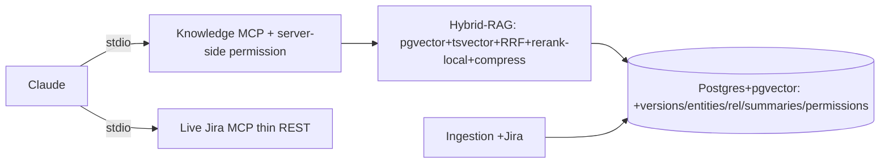
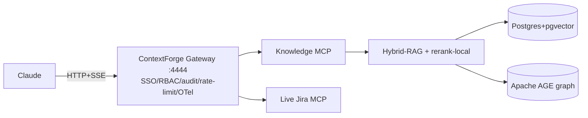
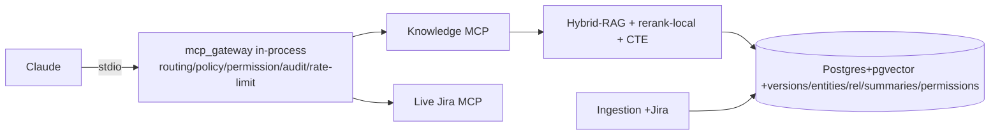

# Company Knowledge (CHG-001) — Options

> Feature: `mcp-data-platform` · Change: CHG-001 (Company Knowledge layer trên nền 9-nguồn read-only
> đã go-live local) · Mode: **options** (tier=large) · Author: squad-sa · Date: 2026-10-01
> Inputs: `1-discovery/market-research.md` (DP1..DP5 + nguồn [1]–[26]), `company-knowledge-mcp-spec.md` v1.0,
> `4-design/architecture.md` (nền hiện tại), `records/decisions.md` (D-001 size LARGE, CEO Gate-1 Option A),
> `9-retro/retro.md` (DK2/DK3), ADR-0002/0003/0007/0010/0011/0016, `knowledge/lessons.md` (L-001/L-002/L-003),
> `platform-baseline.md` (**vendors=none**, các mục TBD → baseline hiệu lực = option đã duyệt Gate A/B).
>
> **Scope của tài liệu này:** so sánh ≥3 option tổng thể cho CHG-001 để CEO quyết ở Gate 1. Không viết
> contract chi tiết (đó là mode `design` sau Gate 1). Mỗi option nêu rõ lập trường cho 5 điểm quyết định
> then chốt **DP1–DP5** vì chúng tương tác mạnh (gateway ↔ stdio ↔ permission ↔ egress).
>
> **ADR-deviation bắt buộc:** [`docs/adr/0017-chg001-company-knowledge-deviation.md`](../../../../adr/0017-chg001-company-knowledge-deviation.md)
> (proposed; deviation 100/100; NFR-005 stdio-only vs Gateway là điểm chính CEO quyết).

## Năm điểm quyết định then chốt (tóm tắt, chi tiết nằm trong từng option)

| ID | Quyết định | Trục đánh đổi chính | Bất biến bị chạm |
|---|---|---|---|
| **DP1** | Company MCP Gateway: build mỏng **in-process giữ stdio** vs **service HTTP OSS** (IBM ContextForge) vs **hoãn sang v1.1** | NFR-005 stdio-only + SPOF vs capability auth/audit/rate-limit có sẵn | NFR-005 (stdio-only), ADR-0003 Alt 3 (đã bác proxy chung) |
| **DP2** | Reranker: **cross-encoder local nạp-offline** (bge-reranker-v2-m3) vs **không rerank (chỉ RRF)** ở v1 vs **API trả tiền** (Cohere/Voyage) | chất lượng NDCG vs egress + vendors=none vs thời gian | data-boundary (dữ liệu nội bộ không ra ngoài), vendors=none |
| **DP3** | Hybrid: **tsvector+pgvector+RRF trong 1 Postgres** (kế thừa spike S3) vs **engine ngoài** | tái dùng store vs ranking BM25 corpus-wide | "Postgres là knowledge store" (spec §4.4) |
| **DP4** | Relationship: **recursive CTE trong Postgres** vs **Apache AGE / graph riêng** | đủ cho graph nông 2–3 hop vs traversal sâu | "một store" (spec §4.4), datastore mới |
| **DP5** | Jira: **thin REST read-only client** (ADR-0007), tách flavor Cloud/Server-DC | bề mặt ghi = 0 vs tốc độ của SDK | read-only tuyệt đối (BR-001/NFR-001) |

**Ràng buộc xuyên suốt mọi option (không option nào được nới):**
- **Read-only invariant** (BR-001/NFR-001, **L-001**): mọi tool mới của Knowledge/Live-Jira phải đi qua đúng
  một **choke point** đã có (`mcp_common` 5 lớp, ADR-0003) + **adversarial test** (gọi tool "ghi" không tồn tại,
  method ≠ GET/HEAD bị transport assert bác). Guarantee trong docstring/ADR mà không có test = chưa enforce.
- **Server-side permission trước context assembly** (spec §24/§43): filter `visibility`/`document_permissions`
  phải chạy **trước** khi lắp context-pack, enforce server-side, không dựa Claude. Khởi điểm là ADR-0016 (kb
  team-only, default-deny) — mọi option đảo giả định C6 (no RBAC per-user) nên là bề mặt bảo mật mới HIGH.
- **Egress HF 403** (ADR-0010 A1): mọi model local (embedding bge-m3 **và** reranker bge/Qwen3/mxbai) phải
  **nạp weights offline** (`HF_HUB_OFFLINE=1`); nếu không, DP2 bị chặn y hệt bake-off S2 đang treo.
- **Retro follow-up chặn build** (D-002/D-003):
  - **DK2** — fix R-006/R-007 **migration-locking** (`NOT VALID`, `CREATE INDEX CONCURRENTLY` ngoài transaction
    per-file) **trước** lần thay schema đầu trên dữ liệu prod đã có (= epic E1). Hiện chỉ an toàn cho deploy
    đầu (empty table).
  - **DK3** — Redis dev ACL (`mcp_ro` broad grants + `default nopass +@all`, R-013) **không** tái dùng cho
    staging/shared; ghi vào env-promotion của CHG-001.
- **vendors=none** (platform-baseline): bất kỳ API trả tiền / service mới = **deviation** phải nêu rõ cho CEO ở
  Gate 1 (ADR-0017).

---

## Option A — Minimal-deviation, tái dùng tối đa (All-in-Postgres, giữ stdio, hoãn Gateway)

### Summary
Dựng tầng Company Knowledge **hoàn toàn trong nền hiện tại**: schema mới (versions/entities/relationships/
summaries/permissions) trong cùng Postgres+pgvector; hybrid trong 1 DB; relationship bằng recursive CTE;
reranker local nạp-offline; Jira bằng thin REST client. **Hoãn Company MCP Gateway (C2) sang v1.1** — giữ
multi-server stdio và đẩy authz/permission vào Knowledge MCP (server-side filter ngay trong tool). Không
service HTTP mới, không datastore mới, không vendor.

### Lập trường DP1–DP5
- **DP1 (Gateway): HOÃN sang v1.1.** Giữ stdio-only (NFR-005), tái dùng ADR-0002/0003. Routing Knowledge/Live
  do Claude chọn tool trực tiếp (như hôm nay); audit/rate-limit tối thiểu nằm trong `mcp_common`. Permission
  enforce **server-side ngay trong Knowledge MCP tool** (không cần gateway để làm việc này). → **deviation thấp
  nhất**: không chạm C3 access-model, không SPOF.
- **DP2 (Reranker): cross-encoder local `bge-reranker-v2-m3`** (Apache-2.0, cùng họ bge-m3) nạp-offline
  (`HF_HUB_OFFLINE=1`). Fallback có cờ: nếu weights chưa nạp được → chạy **RRF-only** và đánh dấu
  `reranker=disabled` trong context-pack (minh bạch, không giả chất lượng — L-002). Không egress, không vendor.
- **DP3 (Hybrid): tsvector + pgvector + RRF trong 1 Postgres**, kế thừa trực tiếp spike S3 + iterative scan
  pgvector ≥0.8 (ADR-0011 A3). `simple` config (không stemming) cho khớp mã lỗi/định danh.
- **DP4 (Relationship): recursive CTE** trên bảng `entities`/`relationships`; traversal nông 2–3 hop
  (`depends_on`/`documented_by`/`related_to`) → single-digit ms [13][14][15]. Không extension.
- **DP5 (Jira): thin REST read-only client** theo ADR-0007, tách `read_api`/`client`, flavor Cloud
  (`nextPageToken`) vs Server/DC (`startAt`); incremental `updated >= last_run` + full-reconcile cho xoá
  (ADR-0011 A1 tombstone).

### Sketch
```text
Claude ──(stdio, N server như hôm nay)── Knowledge MCP ─┐  Live Jira MCP ─┐
                                          │ permission   │ thin REST GET  │
                                          │ filter(§24)  │                │
                                          ▼              ▼                ▼
                             Hybrid-RAG (vector+tsvector+RRF+rerank-local+compress)
                                          │ CTE relationship
                                          ▼
                        Postgres+pgvector (kb + versions/entities/rel/summaries/permissions)
```


### Fit to Musts (spec §58 V1 DoD)
| Must | A |
|---|---|
| Hybrid retrieval (vector+keyword+metadata+relationship+RRF) | full |
| Reranking | full (local; RRF-only fallback nếu HF chưa nạp) |
| Context compression + context-pack + provenance | full |
| Knowledge MCP business tools | full |
| GitLab/Confluence/Jira ingestion + versioning | full |
| Local snapshot offline + live verification + freshness | full |
| Permission filtering server-side (§24/§43) | full (trong Knowledge MCP, không qua gateway) |
| **Company MCP Gateway (§6)** | **no — hoãn v1.1** |
| Retrieval eval dataset + MCP/RAG telemetry | full |

### Time to go-live
**~16–22 ngày-agent** (giả định: tái dùng pipeline/connector + store hiện có; không có service/datastore mới
để dựng; Jira client theo khuôn ADR-0007 đã có tiền lệ).

### Build effort
E1 schema+DK2 (3–4) · E2 Jira (2–3) · E3 Hybrid+rerank (4–6) · E4 Knowledge tools (3–4) · E5 live/offline (2–3)
· E6 permission server-side (2–3) · E8 eval/telemetry (2–3). **Tổng 18–26 ngày-agent** (low–high).

### Run cost
**$0/tháng ngoài hạ tầng đang chạy** (as of 2026-10-01): 1 Postgres+pgvector + process local. Reranker local =
RAM/CPU trên host (bge-reranker-v2-m3 568M). Không licence, không API.

### Risks
1. Chất lượng reranker/hybrid **chưa đo được** tới khi gỡ egress HF / nạp offline — **M** (kế thừa gap S2/S3,
   L-002: đánh dấu UNVERIFIED, không đọc proxy như NFR).
2. Không có gateway ⇒ audit/rate-limit/SSO tập trung thiếu; nếu sau này cần multi-user remote phải thêm tầng —
   **L** ở v1 local (per-user stdio, ADR-0016).
3. Permission filter đặt trong mỗi tool (không một choke point gateway) ⇒ dễ sót nếu thêm tool mới — **M**;
   giảm thiểu bằng L-001 (một hàm `enforce_permission()` chung + adversarial test trả tài liệu `restricted`).

### Lock-in / reversibility
Gần như không lock-in: tất cả trong Postgres + code nội bộ. Thêm gateway sau = thêm tầng trước, không phải viết
lại. **Dễ đảo nhất.**

### Operating burden
Một người vận hành đúng những gì đang chạy hôm nay + 1 model reranker local. Không service mới để on-call.

### Security & data
Dữ liệu không rời biên giới công ty (local). Trust boundary mới = permission filter trong Knowledge MCP (HIGH
nếu sai — L-001 áp dụng). Reranker/embedding offline → **không egress**.

---

## Option B — Max-capability, full spec (ContextForge HTTP gateway + reranker + Apache AGE graph)

### Summary
Triển khai **đúng và đủ** spec §55: thêm **Company MCP Gateway là service HTTP** (IBM ContextForge, Apache-2.0)
làm biên MCP hợp nhất với SSO/RBAC/audit/rate-limit/OTel; relationship bằng **Apache AGE** (openCypher trên
Postgres) cho traversal sâu; reranker local; hybrid trong Postgres. Capability cao nhất, **deviation cao nhất**:
đổi access-model sang HTTP-fronted (chạm NFR-005), thêm 1 service + 1 extension graph mới cần vận hành.

### Lập trường DP1–DP5
- **DP1 (Gateway): CHẤP NHẬN service HTTP OSS — IBM ContextForge** [1] (Apache-2.0, federation nhiều MCP server,
  JWT/SSO, RBAC, rate-limit, audit viewer, OTel, SSRF guard). **Đánh đổi: phá NFR-005 stdio-only** — ContextForge
  vận hành là service HTTP `:4444` (README nói "stdio available for server-side use" nhưng mô hình là HTTP;
  **cần spike nhỏ xác nhận có nhúng stdio không mở cổng mạng không** — nếu không thì vi phạm NFR-005). ADR-0003
  Alt 3 **đã bác** "proxy chung" vì phá stdio + SPOF — Option B chủ động đảo quyết định đó. **Deviation ADR bắt
  buộc** (ADR-0017 ghi NFR-005; ContextForge không phải vendor trả phí nên không +40 egress, nhưng là service +
  pattern mới).
- **DP2 (Reranker): cross-encoder local** như A (offline). (Không chọn API ở B để không chồng thêm egress lên
  một deviation đã lớn.)
- **DP3 (Hybrid): tsvector+pgvector+RRF trong Postgres** như A.
- **DP4 (Relationship): Apache AGE** (extension graph trên Postgres) cho openCypher, traversal sâu hơn CTE.
  **Deviation: datastore/pattern mới** (extension bên thứ ba; licence/maturity **unverified** — phải mở repo kiểm
  SPDX trước khi chốt [17]); Cypher-trong-SQL trả untyped, thêm lớp parse [14][16].
- **DP5 (Jira): thin REST client** như A (không đổi).

### Sketch
```text
Claude ──(HTTP+SSE / stdio bridge)── Company MCP Gateway (ContextForge :4444)
                                      │ SSO · JWT · RBAC · audit · rate-limit · OTel
                 ┌────────────────────┼────────────────────┐
                 ▼                    ▼                    ▼
           Knowledge MCP          Live MCP (Jira…)     (Action MCP sau)
                 ▼
   Hybrid-RAG + rerank-local  →  Postgres+pgvector + **Apache AGE graph**
```


### Fit to Musts
| Must | B |
|---|---|
| Hybrid + reranking + compression + context-pack | full |
| Knowledge MCP tools | full |
| Ingestion + versioning + Jira | full |
| Offline + live + freshness | full |
| Permission server-side (§24/§43) | full (gateway SSO→identity→filter, đúng spec §43) |
| **Company MCP Gateway (§6)** | **full** |
| Relationship (sâu) | full (AGE) |
| Eval + telemetry | full (OTel từ gateway) |

### Time to go-live
**~30–42 ngày-agent** (giả định: + spike nhúng ContextForge/stdio xác nhận NFR-005, + tích hợp SSO/JWT, +
vận hành AGE extension, + verify SPDX ContextForge/AGE). Rủi ro spike thất bại kéo dài thêm.

### Build effort
A base (18–26) + Gateway integration (6–10) + AGE migrate/graph layer (3–5) + SSO/identity mapping (3–5).
**Tổng 30–46 ngày-agent.**

### Run cost
**$0 licence** (ContextForge Apache-2.0, AGE OSS) nhưng **+1 service HTTP** (gateway process, cổng mạng,
chứng chỉ) + **+1 extension graph** phải vận hành/nâng cấp. Chi phí thật là **operating burden + 1 SPOF**, không
phải tiền licence (as of 2026-10-01).

### Risks
1. **NFR-005 bị phá / SPOF gateway** — **H**: service HTTP là điểm chết tập trung; mâu thuẫn invariant stdio.
   Cần CEO chấp nhận deviation ở Gate 1 (ADR-0017).
2. **ContextForge có chạy stdio-only không mở cổng không** — **M, UNVERIFIED**: phải spike trước khi commit;
   nếu không nhúng được thì buộc mở HTTP = multi-user/remote mà PRD liệt Won't-this-release.
3. **AGE + ContextForge licence/maturity unverified** [17][1] — **M**: mở repo kiểm SPDX; AGE untyped Cypher
   thêm bề mặt lỗi.
4. Permission qua gateway + AGE = **2 bề mặt bảo mật mới** thay vì 1 — **M/H** (L-001 phải phủ cả hai).

### Lock-in / reversibility
Cao hơn A: phụ thuộc ContextForge (config/plugin model) + AGE (dữ liệu graph trong extension). Gỡ gateway =
quay lại stdio nhưng mất audit/SSO đã xây; gỡ AGE = migrate graph về CTE. **Khó đảo nhất.**

### Operating burden
Một người phải chạy + nâng cấp + on-call: gateway service, chứng chỉ/JWT secret, AGE extension, OTel pipeline.
Nặng nhất cho công ty một người.

### Security & data
SSO→identity→permission đúng spec §43 (mạnh nhất trên giấy) **nhưng** gateway HTTP mở một trust boundary mạng
mới + có thể là egress nếu mở remote. DK3 (Redis ACL) tuyệt đối không tái dùng cho gateway shared.

---

## Option C — Trung dung (Postgres hybrid + reranker local + CTE + Gateway MỎNG in-process giữ stdio) — **khuyến nghị**

### Summary
Làm **đủ spec về nghiệp vụ** (Jira, versioning, entities/relationships, summaries, permission server-side,
Hybrid-RAG đầy đủ, Live-vs-Knowledge, freshness/offline) **nhưng giữ bất biến kiến trúc**: Gateway là một
**thư viện/boundary MỎNG in-process** (auth-context + policy enforce + audit + rate-limit nằm trong một module
`mcp_gateway` dùng chung, **không** là service HTTP, **giữ stdio** NFR-005). Relationship bằng CTE; reranker
local; tất cả trong Postgres. = Option A **cộng** một gateway-boundary mỏng thỏa trách nhiệm §6 ở mức process,
để sau này mở HTTP (v1.1) chỉ cần đổi transport chứ không viết lại policy.

### Lập trường DP1–DP5
- **DP1 (Gateway): BUILD mỏng IN-PROCESS giữ stdio.** Một module `mcp_gateway` cung cấp: tool-discovery +
  routing (Knowledge/Live), **policy/permission enforce server-side**, audit log, rate-limit — **chạy trong
  process** của runtime stdio hiện có (ADR-0002), **không mở cổng mạng** → **không phá NFR-005, không SPOF
  service**. Trách nhiệm §6 được thỏa ở tầng code; khi mở HTTP+SSE v1.1 (BR-004/C4) chỉ thay transport trước
  cùng module. → **deviation vừa phải** (new architecture pattern "gateway-as-boundary" nhưng **không** service/
  datastore/vendor mới). ADR-0017 ghi rõ: C đáp ứng §6 mà **giữ** invariant stdio, khác hẳn B.
- **DP2 (Reranker): cross-encoder local `bge-reranker-v2-m3`** offline + RRF-only fallback có cờ (như A).
  API trả tiền **loại trừ** (vendors=none + egress).
- **DP3 (Hybrid): tsvector+pgvector+RRF trong 1 Postgres** (kế thừa S3, iterative scan ≥0.8).
- **DP4 (Relationship): recursive CTE** trong Postgres (graph nông đủ cho spec §21–22). AGE để dành khi **đo
  được** CTE chậm (nước đi tương lai, không phải v1).
- **DP5 (Jira): thin REST read-only client** (ADR-0007), tách Cloud/Server-DC flavor, incremental + full-reconcile.

### Sketch
```text
Claude ──(stdio, giữ NFR-005)── runtime ── [ mcp_gateway (in-process) ]
                                             │ routing · policy · permission(§24) · audit · rate-limit
                               ┌─────────────┼─────────────┐
                               ▼             ▼             ▼
                         Knowledge MCP    Live Jira MCP   (Action sau)
                               ▼
             Hybrid-RAG (vector+tsvector+RRF+rerank-local+compress) + CTE relationship
                               ▼
             Postgres+pgvector (+versions/entities/rel/summaries/permissions)
```


### Fit to Musts
| Must | C |
|---|---|
| Hybrid + reranking + compression + context-pack | full |
| Knowledge MCP tools | full |
| Ingestion + versioning + Jira | full |
| Offline + live + freshness/conflict/authority | full |
| Permission server-side (§24/§43) | full (enforce trong gateway-boundary, trước context assembly) |
| **Company MCP Gateway (§6 responsibilities)** | **full ở tầng process** (routing/auth-context/policy/audit/rate-limit) — **transport = stdio, không service HTTP** |
| Relationship | full (CTE, nông) |
| Eval + telemetry | full |

### Time to go-live
**~20–28 ngày-agent** (A + ~4–6 cho gateway-boundary mỏng; không spike service HTTP, không AGE).

### Build effort
A base (18–26) + `mcp_gateway` in-process (routing/policy/audit/rate-limit) (4–6). **Tổng 22–32 ngày-agent.**

### Run cost
**$0/tháng ngoài hạ tầng hiện có** (as of 2026-10-01): không service/datastore/vendor mới; gateway là code trong
process stdio. Reranker local = RAM/CPU host.

### Risks
1. Chất lượng reranker/hybrid **UNVERIFIED** tới khi gỡ egress HF/nạp offline — **M** (như A; L-002).
2. Gateway-boundary mỏng tự viết phải tự làm audit/rate-limit/policy (không có sẵn như ContextForge) — **M**;
   giảm thiểu: phạm vi §6 ở mức cần cho local, không SSO đầy đủ (SSO thật để v1.1 khi mở HTTP).
3. Permission + read-only là 2 guarantee mới → **M/H**: bắt buộc **một choke point** (`mcp_gateway.enforce`) cho
   cả hai + adversarial test (L-001: tool "ghi" không tồn tại bị bác; caller không-quyền không thấy tài liệu
   `restricted` trước khi context-pack lắp).

### Lock-in / reversibility
Thấp như A (tất cả code nội bộ + Postgres). Mở HTTP v1.1 = thêm transport trước `mcp_gateway`, **không viết
lại** policy. **Dễ đảo**, đồng thời **đặt sẵn đường** cho capability của B mà chưa gánh chi phí/deviation của B.

### Operating burden
Như A (không service mới) + duy trì một module gateway in-process. Không on-call service HTTP.

### Security & data
Dữ liệu local, không egress (reranker/embedding offline). **Một** trust boundary mới (gateway-boundary) chứa cả
permission filter + read-only choke point → tập trung đúng theo L-001. DK3 áp dụng cho mọi credential.

---

## Baseline — do nothing / defer

Không làm CHG-001 (hoặc hoãn vô thời hạn). Chi phí của việc không hành động:
- Nền 9-nguồn đã go-live local vẫn chạy, nhưng **spec Company Knowledge không được đáp ứng**: không Jira, không
  hybrid/rerank/relationship, không versioning, không Live-vs-Knowledge, không permission server-side.
- Nỗi đau PRD (đối chiếu thủ công nhiều nguồn, điều tra incident chậm) **không được giảm thêm** so với hiện tại.
- **NFR-003 (chất lượng truy hồi) vẫn UNVERIFIED** — việc đo thật (gỡ egress HF + ADR-0010) chỉ được lên lịch
  **trong** CHG-001 (DK1/D-002); do-nothing giữ nguyên rủi ro tồn dư CEO đã chấp nhận ở Gate 2.
- CEO đã quyết Gate-1 **Option A của D-001** (đóng scope cũ trước, rồi mở CHG-001) → "defer" mâu thuẫn quyết
  định đã ghi. Chỉ nêu làm baseline so sánh; **không khuyến nghị**.

---

## Scoring

Trọng số mặc định theo `squad-options-analysis` (tổng 100). Không đổi trọng số. Điểm 1–5 (5 tốt nhất).

| Criterion | Weight | A (raw) | B (raw) | C (raw) |
|---|---|---|---|---|
| Value / fit to Musts | 30 | 4 (thiếu Gateway §6) | 5 (full spec) | 5 (full nghiệp vụ + §6 ở tầng process) |
| Time to value | 20 | 5 (16–22d) | 2 (30–42d + spike) | 4 (20–28d) |
| Total cost (build + 12 th run) | 20 | 5 ($0 run, build thấp) | 2 (build cao + burden service/graph) | 4 ($0 run, build vừa) |
| Risk (delivery, security, vendor) | 15 | 4 (ít deviation; thiếu gateway audit) | 2 (phá NFR-005 + SPOF + unverified spike/licence) | 4 (giữ invariant; 2 guarantee mới có choke point) |
| Maintainability, operating burden & strategic fit | 15 | 4 (ít gánh; nhưng phải thêm gateway sau) | 2 (nặng nhất; lock-in) | 5 (ít gánh + đặt sẵn đường mở HTTP) |

### Weighted totals
- **Option A** = 30·4 + 20·5 + 20·5 + 15·4 + 15·4 = 120+100+100+60+60 = **440 / 500** (4.40).
- **Option B** = 30·5 + 20·2 + 20·2 + 15·2 + 15·2 = 150+40+40+30+30 = **290 / 500** (2.90).
- **Option C** = 30·5 + 20·4 + 20·4 + 15·4 + 15·5 = 150+80+80+60+75 = **445 / 500** (4.45).

Thứ hạng: **C (445) > A (440) > B (290).**

---

## Recommendation

**Khuyến nghị Option C — Trung dung** (gateway MỎNG in-process giữ stdio + Postgres hybrid + reranker local
offline + CTE + Jira/versioning/permission server-side).

Vì sao (3 bullet):
1. **Đáp ứng đủ nghiệp vụ của spec §55 (gồm trách nhiệm Gateway §6 ở tầng process) mà GIỮ bất biến kiến trúc
   quan trọng nhất** — NFR-005 stdio-only và "một store Postgres" — nên deviation nhỏ hơn B rất nhiều và không
   thêm service/datastore/vendor (vendors=none được tôn trọng).
2. **Chi phí/thời gian gần A** ($0 run, 20–28 ngày-agent) nhưng **điểm value + strategic fit cao hơn A**: C đặt
   sẵn `mcp_gateway` làm boundary nên khi mở HTTP+SSE v1.1 (BR-004/C4) chỉ đổi transport, **không viết lại
   policy** — A phải thêm cả tầng sau.
3. **An toàn theo đúng bài học của feature**: một choke point duy nhất cho cả read-only (L-001) **và** permission
   server-side (§24/§43), + adversarial test; không egress (reranker/embedding offline); gánh DK2/DK3 trước build.

## Sensitivity

(±30% trên bất định lớn nhất)
- Bất định lớn nhất = **build effort gateway + chất lượng reranker chưa đo (UNVERIFIED)**.
- Nếu build gateway-boundary của C **đội 30%** (4–6 → ~5–8 ngày): C ≈ A về time/cost (A vẫn thiếu §6), C vẫn
  dẫn vì value/strategic fit. **Ranking không đổi.**
- Nếu CEO **chấp nhận deviation NFR-005** và coi SSO/audit đầy đủ của gateway là bắt buộc ngay v1 (không hoãn):
  value của B tăng, nhưng risk/operating-burden của B vẫn kéo xuống (SPOF + spike + lock-in) → B chỉ vượt khi
  trọng số Risk+Maintainability giảm mạnh (≥ −30% mỗi mục) — tức CEO chủ động chấp nhận SPOF. Khi đó **B mới
  cạnh tranh**; mặc định C vẫn thắng.
- Nếu reranker local **không nạp offline được** (egress vẫn chặn): cả A/C rơi về **RRF-only** (fallback có cờ),
  value giảm đều ở A và C → **không đổi thứ hạng A↔C**; B cũng dính y hệt (B cũng dùng reranker local).

### What would change our mind (bằng chứng lật khuyến nghị)
- **Spike xác nhận ContextForge nhúng được stdio không mở cổng mạng** (giữ NFR-005) **và** SPDX Apache-2.0 xác
  minh → B mất phần lớn rủi ro NFR-005/SPOF, có thể vượt C về value với burden chấp nhận được. (Hiện UNVERIFIED.)
- **Đo thật cho thấy recursive CTE chậm** trên relationship graph thật của team ở 2–3 hop → DP4 của A/C phải đổi
  sang AGE (nghiêng về B ở DP4); nhưng chỉ đổi DP4, không nhất thiết đổi DP1.
- **CEO quyết v1 phải là multi-user/remote ngay** (đảo Won't-this-release của PRD) → gateway HTTP trở thành
  must → B.

---

## Những điểm CEO phải quyết ở Gate 1 (vào gate-brief)

1. **DP1 / NFR-005 (chính):** chấp nhận Option C (gateway MỎNG in-process, **giữ** stdio) — hay chấp nhận
   **deviation NFR-005** để dùng service HTTP ContextForge (Option B) — hay hoãn Gateway sang v1.1 (Option A).
   → quyết này mở/giữ baseline `platform-baseline.md` (ADR-0017).
2. **DP2 reranker API:** mặc định mọi option dùng **reranker local offline** (không egress, vendors=none). CEO
   chỉ cần quyết **nếu** muốn mở deviation cho API trả tiền (Cohere/Voyage) — khi đó PO phải lấy giá "as of" từ
   trang pricing (hiện **không ghi** vì vendors=none loại trừ mềm). Khuyến nghị: **không** mở.
3. **Chấp nhận NFR-003 vẫn UNVERIFIED tới khi đo được trong CHG-001** (gỡ egress HF / nạp offline) — nối tiếp
   DK1/D-002; nếu không chấp nhận, build phải chờ unblock egress trước E3.
4. **Baseline inheritance:** CEO chốt những gì vào `platform-baseline.md`/`business-baseline.md` nếu duyệt C
   (Jira là nguồn thứ 10; Hybrid-RAG + reranker local; gateway-as-boundary in-process; 4 domain dữ liệu mới;
   permission server-side đảo giả định C6/BR-003).

## Uncovered points (chưa đủ bằng chứng để chốt ở options; để design/spike)
- **ContextForge stdio-only** (NFR-005) và **SPDX licence** của ContextForge/AGE/ParadeDB/pg_igraph/các gateway
  nhỏ — **UNVERIFIED**; cần mở repo + spike nhúng trước khi B/DP4-AGE được chốt (market-research "Confidence & gaps").
- **Số đo thật DP2 (reranker) & DP3 (hybrid)** — UNVERIFIED do egress HF 403 + chưa có corpus/model thật; đo
  trong design/E3 sau khi gỡ egress (kế thừa S2/S3, L-002).
- **Giá API Cohere/Voyage/Jina** — không ghi (vendors=none); chỉ lấy nếu CEO mở deviation DP2 ở Gate 1.

```
HANDOFF
feature: mcp-data-platform
mode: options
status: done
artifacts: [1-discovery/options.md, docs/adr/0017-chg001-company-knowledge-deviation.md]
uncovered_fr: [ ]
review: accepted=0 rejected=0
cost_forecast: build=A 18–26d / B 30–46d / C 22–32d (ngày-agent) · monthly=A $0 / B $0 licence +1 service&graph burden / C $0 (ngoài hạ tầng hiện có) | vs baseline Gate-A/B ($0 run)
adr_deviation: docs/adr/0017-chg001-company-knowledge-deviation.md
recommended_option: C (trung dung — gateway mỏng in-process giữ stdio) · scores C=445 > A=440 > B=290 / 500
needs_user_decision:
  - DP1/NFR-005: C in-process (giữ stdio) vs B deviation service HTTP ContextForge vs A hoãn gateway v1.1 → ADR-0017, chốt baseline
  - DP2: giữ reranker local offline (khuyến nghị) hay mở deviation API trả tiền (vendors=none → cần CEO)
  - Chấp nhận NFR-003 UNVERIFIED tới khi đo trong CHG-001 (nối DK1/D-002) hay chặn build tới khi gỡ egress HF
  - Baseline inheritance nếu duyệt C: Jira nguồn thứ 10, Hybrid-RAG+rerank-local, gateway-as-boundary in-process, 4 domain dữ liệu mới, permission server-side (đảo C6/BR-003)
```
