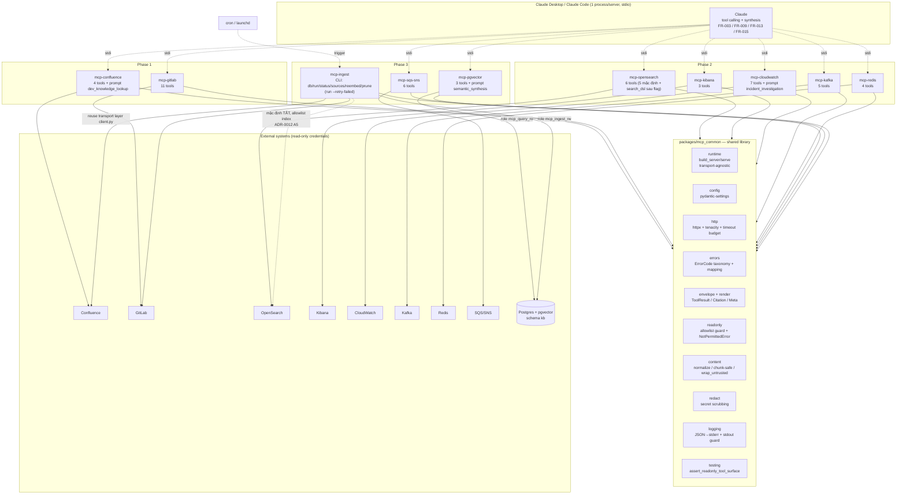
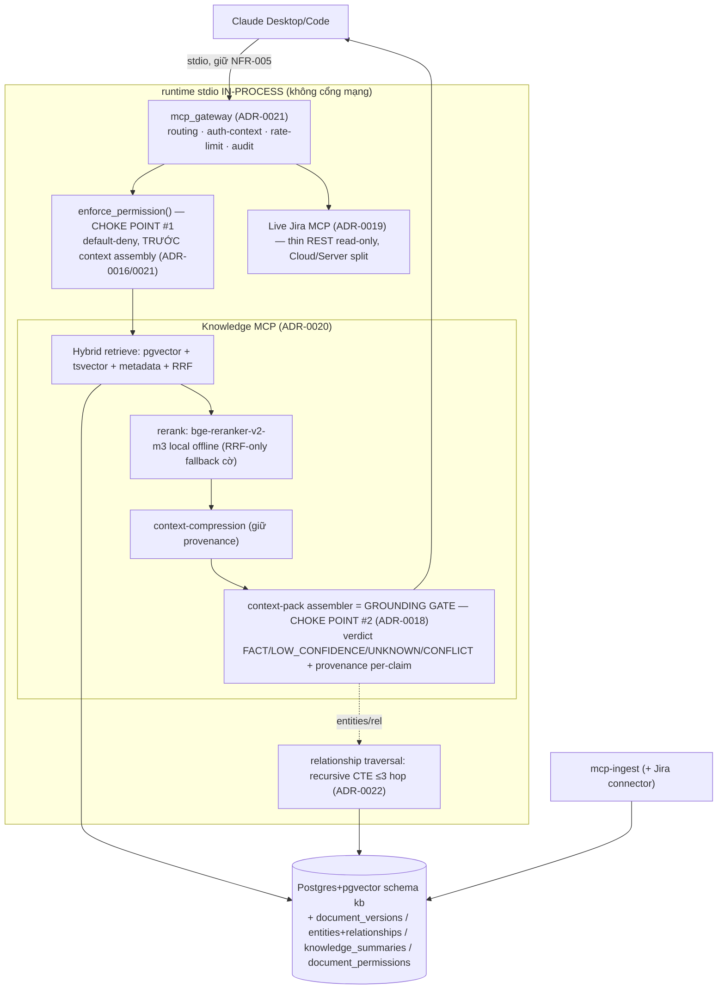
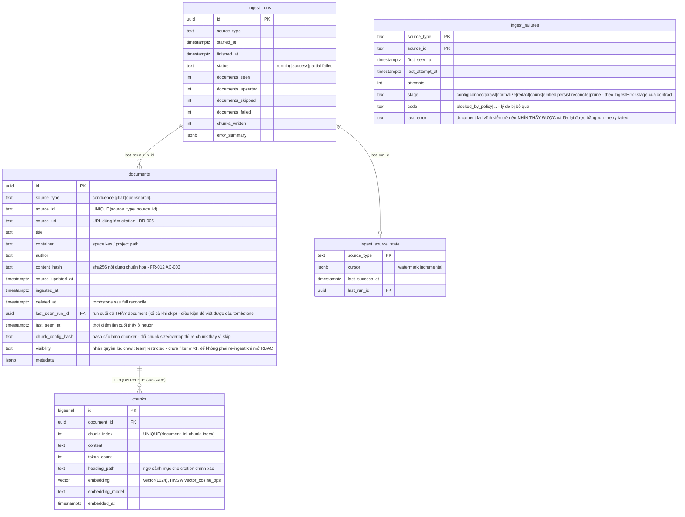
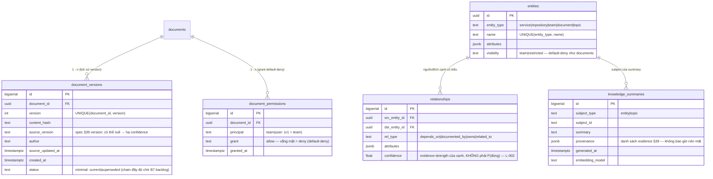
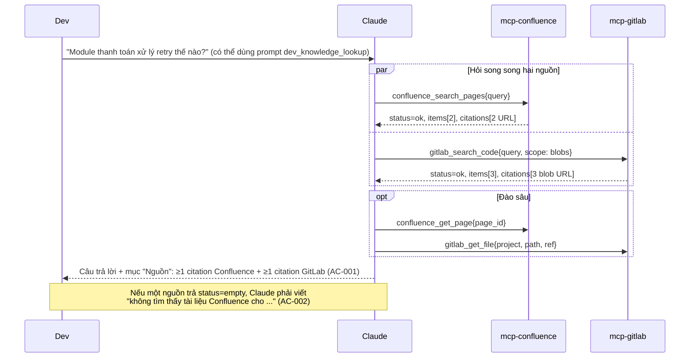
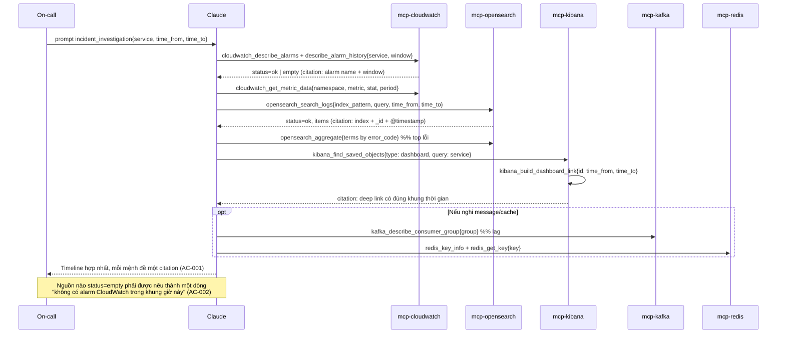

# MCP Data Platform — Architecture

> Nguồn đầu vào: `requirements.md` (FR-001…FR-015, NFR-001…NFR-005, BR-001…BR-005),
> `product-requirement.md`. Contract: `api-contract.yaml`. ADR: `docs/adr/0001…0016`.
> Tài liệu này đã được **đồng bộ lại với phần "Amendments" của các ADR sau design review
> 2026-10-01** (ADR-0003, 0006, 0007, 0008, 0009, 0011, 0012, 0015 + ADR-0016 mới). Khi có
> xung đột, **ADR là bản gốc**.
> **Reconcile contract_issue (loops.spec=1, 2026-10-01):** 13 vấn đề do `squad-backend` nêu sau
> Phase 1–3a đã được xử lý — xem "Design review → Reconcile contract_issue từ squad-backend".
> Ngôn ngữ tài liệu: tiếng Việt (`state.json.language = vi`); mọi identifier, schema, tên
> tool, DDL và diagram label bằng tiếng Anh.

## Context & constraints

**Bài toán.** Một tầng MCP cho phép Claude Desktop/Code truy vấn **chỉ-đọc** dữ liệu thật từ
9 nguồn (Confluence, GitLab, OpenSearch, Kibana, CloudWatch, Kafka, Redis, SQS/SNS,
Postgres+pgvector) và trả lời có trích dẫn truy vết được, thay cho việc mở nhiều tab và tự
đối chiếu.

**Ràng buộc bắt buộc (từ requirements.md):**

| # | Ràng buộc | Nguồn |
|---|---|---|
| C1 | Read-only **tuyệt đối** ở cả 9 nguồn, mọi phase; không tool nào có side effect ghi | BR-001, FR-014, NFR-001 |
| C2 | Mọi kết quả phải mang citation truy vết được về hệ nguồn; "không có dữ liệu" phải tường minh | BR-002, BR-005, FR-015 |
| C3 | v1: chạy local, **stdio**, mỗi nguồn một process, không service/UI phụ | NFR-005, Out of scope |
| C4 | Kiến trúc **không chặn** đường mở sang multi-user/remote (HTTP+SSE) về sau | BR-004 |
| C5 | Lỗi mạng/VPN phải thành lỗi tường minh trong thời gian có giới hạn, không treo | NFR-002, PRD risk |
| C6 | Không RBAC per-user ở v1 (giả định truy cập đồng nhất) | BR-003 |
| C7 | Rollout theo phase 1 → 2 → 3, toàn bộ là Must-have | Glossary, Scope |

**Ràng buộc môi trường đã kiểm chứng trên máy dev:** `uv 0.11.7`, `Python 3.14.3`,
`Docker 29.7.2`. Chưa có OpenAPI linter (`spectral`/`redocly` không có) → xem ADR-0013.

**Ba quyết định định hình toàn bộ thiết kế:**

1. **Read-only là thuộc tính kiến trúc, không phải quy ước code** — 5 lớp phòng ngự có kiểm
   chứng tự động (ADR-0003).
2. **Một envelope kết quả duy nhất cho 49 tool** (48 hiển thị mặc định — `opensearch_search_dsl` sau feature flag) — citation bắt buộc, `empty`/`not_found`
   là *status* chứ không phải exception (ADR-0004). Đây là cơ chế duy nhất khiến C2 kiểm
   chứng được.
3. **stdio hôm nay, transport-agnostic từ ngày đầu** — logic tool không biết gì về transport
   (ADR-0002), nên C4 không tốn gì thêm ở v1.

**Điểm quan trọng về C6:** ở v1 mỗi người dùng chạy MCP server bằng **credential của chính
mình** trên máy của mình → phân quyền được *thừa hưởng nguyên vẹn* từ hệ nguồn
(Confluence/GitLab/AWS đã có phân quyền riêng). Vì vậy BR-003 không cần code RBAC ở v1.

**Nhưng có một ngoại lệ tồn tại ngay ở Phase 3, không chờ tới lúc mở HTTP** (ADR-0016): `kb`
(Postgres + pgvector) là nguồn duy nhất mà dữ liệu bị **sao chép ra khỏi hệ nguồn**. Pipeline
crawl bằng `mcp_ingest_rw` và `mcp-pgvector` đọc bằng `mcp_query_ro` — hai credential không
liên quan gì tới người đang hỏi. Một trang Confluence trong space bị giới hạn, một khi đã
embed, sẽ trả về cho **bất kỳ ai** chạy `kb_semantic_search`. Vì vậy: cột
`documents.visibility` được ghi ngay ở Phase 3 (chưa filter), và **user đã quyết (2026-10-01):
corpus `kb` là TEAM-ONLY** (ADR-0016 Phần 2 + A1, *accepted*): `mcp-ingest` từ chối ingest
`visibility != 'team'` và báo qua `kb.ingest_failures{redact, blocked_by_policy}`; nhãn được
suy ra theo quy tắc **default-deny** của spike S5 (ADR-0016 A2). Không có RBAC per-user ở
Phase 3 (T-067 đóng). Rủi ro tồn dư: page Confluence bị đặt restriction mà không đổi nội dung
vẫn tìm được tới full reconcile kế tiếp (ADR-0016 A3). Khi mở remote hosting (C4) thì RBAC là
yêu cầu thật trong mọi trường hợp.

## Tech stack decision

| Layer | Choice | Why | Rejected alternative | ADR |
|---|---|---|---|---|
| Ngôn ngữ / runtime | Python 3.12+ (dev 3.14) | SDK MCP chính thức mạnh nhất ở Python; SDK của mọi nguồn (boto3, opensearch-py, redis, psycopg, kafka) đều có sẵn | TypeScript (SDK MCP tốt nhưng client Kafka/Postgres/embedding yếu hơn) | 0001 |
| Quản lý package | **uv workspace** monorepo, `packages/*` | Một lockfile, dependency tách theo package, chạy được từng server độc lập | Một package đơn 9 entrypoint; polyrepo | 0001 |
| MCP framework | `mcp` SDK (`FastMCP`) + `outputSchema` | Bám spec; test in-memory; `prompts` phục vụ FR-003/009/013 | Tự viết JSON-RPC stdio | 0002 |
| Transport | stdio (v1), `serve()` transport-agnostic | NFR-005; C4 không phải viết lại 9 server | HTTP+SSE ngay ở v1 | 0002 |
| HTTP client | `httpx.AsyncClient` + `tenacity` | Timeout tường minh bắt buộc, retry có phân loại lỗi + `Retry-After` | `requests`; retry sẵn của httpx transport | 0006 |
| Config / secret | `pydantic-settings`, env prefix theo server, `SecretStr`, `*_FILE` | Khớp cách Claude Desktop truyền env; fail fast; least privilege | YAML dùng chung 9 nguồn; Vault ở v1 | 0005 |
| Logging | structured JSON **chỉ ra stderr** + stdout guard | stdout là kênh JSON-RPC; ô nhiễm stdout = hỏng phiên | Log ra stdout/file mặc định | 0005 |
| Confluence / GitLab client | Thin REST client tự viết (`httpx`) | Bề mặt mutating = 0 trong runtime; dùng chung timeout/retry/redaction | `atlassian-python-api`, `python-gitlab` (mang theo toàn bộ API ghi) | 0007 |
| OpenSearch | `opensearch-py` (async) + allowlist endpoint | Client đúng cho OpenSearch; chặn `script`/`_delete_by_query` | `elasticsearch-py` 8.x (từ chối cluster OpenSearch) | 0008 |
| Kibana | Thin REST client | Không có SDK Python chính thức; chỉ cần 3 endpoint GET | — | 0008 |
| AWS (CloudWatch, SQS/SNS) | `boto3` + `asyncio.to_thread` + allowlist API | Ổn định; IAM read-only là lớp phòng ngự 3 | `aioboto3` (bám botocore chặt) | 0008 |
| Redis | `redis.asyncio` + allowlist command + ACL user read-only | `SCAN` thay `KEYS`; ACL chặn ở server | Chỉ dựa vào code không gọi lệnh ghi | 0008 |
| Postgres / pgvector | `psycopg` 3 + `pgvector[psycopg]`, role `mcp_query_ro`, `READ ONLY` tx | Read-only ở tầng DB; SQL tham số hoá viết sẵn | Tool `postgres_query(sql)` tuỳ ý (injection + đọc mọi bảng) | 0008, 0011 |
| Kafka | **`confluent-kafka`** (đề xuất) + `assign()` + no-commit | Đủ AdminClient cho metadata/config/lag; hiệu năng tốt | `kafka-python` (chậm nhịp, là fallback), `aiokafka` (admin yếu), REST Proxy | 0009 |
| Embedding | Port `EmbeddingProvider`; mặc định đề xuất **local `bge-m3`, 1024d, cosine** | Multilingual VI/EN; không chi phí token; dữ liệu nội bộ không ra ngoài | OpenAI `text-embedding-3-small` (rào cản chính sách), Bedrock Titan, e5-large | 0010 |
| Vector store | Postgres + pgvector, HNSW `vector_cosine_ops` | Đã là yêu cầu của PRD; recall tốt ở quy mô dự kiến | IVFFlat; Qdrant/Weaviate | 0011 |
| Migration | SQL đánh số + `mcp-ingest db upgrade` | 6 bảng, không cần ORM; `vector`/HNSW không autogenerate được | Alembic (kéo SQLAlchemy vào pipeline SQL thuần) | 0011 |
| Ingest pipeline | CLI Typer độc lập, scheduler `cron`/`launchd` | Không MCP server nào có credential ghi; cắm vào orchestrator sau này không sửa logic | Airflow/Prefect; tool MCP trigger ingest (vi phạm C1); daemon APScheduler | 0012 |
| Contract | OpenAPI 3.1 mô tả tool interface + snapshot test | Một artifact duy nhất, kiểm chứng 2 chiều BE/QA | JSON Schema rời; AsyncAPI; sinh contract sau khi code | 0013 |
| Test | `pytest` + `pytest-asyncio` + `respx` + `testcontainers`/compose; `jsonschema` cho contract test | Unit không cần network; integration dùng compose local | Chỉ integration với hệ thật (bị chặn bởi VPN) | — |
| Hạ tầng dev | Docker Compose: Postgres+pgvector, Redis, Kafka (KRaft), LocalStack | 4 nguồn emulate được; 5 nguồn còn lại là remote thật | — | — |

## Component view



### Trách nhiệm từng component

| Component | Trách nhiệm | Không chịu trách nhiệm |
|---|---|---|
| `mcp_common.runtime` | Dựng `FastMCP`, đăng ký tool/prompt, chọn transport, áp deadline tổng cho mỗi tool call, **chạy startup credential check và từ chối serve nếu credential không tự chứng minh read-only** (ADR-0003 A1), cấp **`ThreadPoolExecutor` riêng có biên `max_workers=4`** cho mọi SDK đồng bộ (boto3, confluent-kafka — `asyncio.timeout` không huỷ được thread, ADR-0006 A1), bắt exception → envelope error | Biết về bất kỳ nguồn cụ thể nào |
| `mcp_common.config` | `CommonSettings` + loader theo env prefix, validate fail-fast | Lưu secret ở đâu (chỉ đọc env/`*_FILE`) |
| `mcp_common.http` | `AsyncClient` duy nhất có timeout tường minh, retry phân loại, `Retry-After` kẹp theo budget còn lại (ADR-0006 A3), **assertion ở tầng transport: mọi request đi ra phải `GET`/`HEAD` trừ allowlist `(host, method, path)` tường minh** (ADR-0003 A2) | Logic nghiệp vụ của nguồn |
| `mcp_common.errors` | Taxonomy `ErrorCode` + mapper từ exception của httpx/boto3/psycopg/redis/kafka | Quyết định retry (thuộc `http`) |
| `mcp_common.envelope` + `render` | `ToolResult`, `Citation`, `Meta`; render bản text kèm citation cho Claude | Nội dung item của từng nguồn |
| `mcp_common.readonly` | `enforce(allowlist, op)`, `NotPermittedError`, decorator `@readonly_tool` | Cấp credential (việc của vận hành) |
| `mcp_common.content` | Chuẩn hoá (storage-format/HTML/ADF → markdown/text), cắt theo byte, `wrap_untrusted` | Chunking cho embedding (thuộc `mcp_ingest`) |
| `mcp_common.redact` | Scrub secret ở log và ở output | Chính sách chặn key/path (cấu hình theo server) |
| `mcp_common.testing` | Fixture chung: tool-surface snapshot, **transport assertion GET/HEAD + assertion contract `x-readonly: true` / `x-side-effects: none`** (deny-regex theo tên tool chỉ còn là *warning*, ADR-0003 A2), `assert_readonly_tool_surface` phủ cả method mà `mcp-ingest` gọi (ADR-0012 A4) | Test nghiệp vụ từng nguồn |
| `mcp-<source>` (×9) | Hai tầng client: `client.py` (transport + allowlist + timeout, dùng chung với connector ingest) và `read_api.py` (bound dành riêng cho tool) + mapper sang envelope + khai báo tool/prompt + `doctor` (ADR-0007 A3, ADR-0012 A4) | Bất kỳ ghi dữ liệu nào; gọi nguồn khác |
| `mcp-pgvector` | Semantic search read-only trên `kb` bằng role `mcp_query_ro`; embed câu hỏi bằng **cùng** provider của pipeline | Ghi/ingest; chạy SQL tuỳ ý |
| `mcp-ingest` | Crawl (dùng lại tầng transport `client.py` của các server), normalize → **redact** → chunk → embed → upsert idempotent, checkpoint, tombstone có safety valve, ghi `kb.ingest_failures`, báo cáo run *(một hàng `ingest_runs` cho mỗi nguồn mỗi run)* | Phục vụ MCP client (không phải server); dùng `read_api.py` |
| `infra/docker-compose.yml` | Postgres+pgvector, Redis, Kafka (KRaft), LocalStack cho dev/test | Confluence/GitLab/OpenSearch/Kibana/CloudWatch (remote thật) |

### Cấu trúc thư mục chuẩn của một server (Lead dùng để chia task)

```
packages/mcp_<source>/
  pyproject.toml                 # deps riêng + console_script mcp-<source>
  src/mcp_<source>/
    __init__.py
    settings.py                  # Settings(env_prefix="MCP_<SOURCE>_")
    ports.py                     # (nếu cần đổi implementation: Kafka, Embedding)
    client.py                    # tầng transport: HTTP/SDK + ALLOWED_OPERATIONS + timeout
                                 #   (dùng chung với connector của mcp-ingest)
    read_api.py                  # tầng tool: bound limit<=100, time range<=31d, max_bytes
                                 #   (ADR-0007 A3 / ADR-0012 A4 — connector KHÔNG dùng file này)
    mappers.py                   # payload nguồn -> item schema + Citation
    tools.py                     # @mcp.tool(...) + outputSchema
    prompts.py                   # (chỉ server anchor: confluence/cloudwatch/pgvector)
    server.py                    # build_server() -> FastMCP
    cli.py                       # main(): serve(); subcommand: doctor, tools-dump
    tools.snapshot.json          # bề mặt tool đã chốt (NFR-001, ADR-0013)
  tests/
    test_tools_readonly.py       # NFR-001 / FR-014
    test_contract.py             # snapshot + api-contract.yaml
    test_<tool>.py               # unit với respx/mock
    test_integration.py          # @pytest.mark.live (chạy tay khi có VPN)
```

### Bề mặt tool đầy đủ (49 tool, 3 prompt, 6 lệnh CLI)

**Bề mặt hiển thị mặc định: 48 tool** — `opensearch_search_dsl` chỉ được đăng ký khi
`MCP_OPENSEARCH_ALLOW_DSL=true` (ADR-0008 A7). Theo phase: Phase 1 = 15, Phase 2 = **24**
mặc định (25 khi bật flag), Phase 3 = 9.

| Server | Phase | Tools | FR |
|---|---|---|---|
| `mcp-confluence` | 1 | `confluence_search_pages`, `confluence_get_page`, `confluence_list_spaces`, `confluence_list_page_children` | FR-001, FR-003 |
| `mcp-gitlab` | 1 | `gitlab_search_projects`, `gitlab_search_code`, `gitlab_get_file`, `gitlab_list_repository_tree`, `gitlab_list_commits`, `gitlab_list_merge_requests`, `gitlab_get_merge_request`, `gitlab_list_issues`, `gitlab_get_issue`, `gitlab_list_pipelines`, `gitlab_get_pipeline` | FR-002, FR-003 |
| `mcp-opensearch` | 2 | `opensearch_list_indices`, `opensearch_get_mapping`, `opensearch_search_logs`, `opensearch_count`, `opensearch_aggregate`, `opensearch_search_dsl` | FR-004, FR-009 |
| `mcp-kibana` | 2 | `kibana_find_saved_objects`, `kibana_get_saved_object`, `kibana_build_dashboard_link` | FR-005, FR-009 |
| `mcp-cloudwatch` | 2 | `cloudwatch_list_log_groups`, `cloudwatch_filter_log_events`, `cloudwatch_run_logs_insights`, `cloudwatch_list_metrics`, `cloudwatch_get_metric_data`, `cloudwatch_describe_alarms`, `cloudwatch_describe_alarm_history` | FR-006, FR-009 |
| `mcp-kafka` | 2 | `kafka_list_topics`, `kafka_describe_topic`, `kafka_peek_messages`, `kafka_list_consumer_groups`, `kafka_describe_consumer_group` | FR-007, FR-009 |
| `mcp-redis` | 2 | `redis_scan_keys`, `redis_get_key`, `redis_key_info`, `redis_server_info` | FR-008, FR-009 |
| `mcp-sqs-sns` | 3 | `sqs_list_queues`, `sqs_get_queue_attributes`, `sqs_list_dead_letter_source_queues`, `sns_list_topics`, `sns_get_topic_attributes`, `sns_list_subscriptions_by_topic` | FR-010, FR-013 |
| `mcp-pgvector` | 3 | `kb_semantic_search`, `kb_get_document`, `kb_list_sources` | FR-011, FR-013 |
| `mcp-ingest` | 3 | *(CLI, không phải tool)* `db upgrade`, `run`, `status`, `sources`, `reembed`, `prune` | FR-012 |

**Bộ lệnh CLI của `mcp-ingest` (ADR-0012 + A5)**

| Lệnh | Mô tả một dòng |
|---|---|
| `db upgrade` | Áp các file migration SQL đánh số, theo dõi qua `kb.schema_migrations` |
| `run [--source …] [--mode incremental\|full] [--since …] [--dry-run] [--limit N]` | Chạy pipeline crawl → redact → chunk → embed → upsert cho một/nhiều nguồn |
| `run --retry-failed` | Chạy lại đúng các document đang nằm trong `kb.ingest_failures` (ADR-0012 A2/A5) — đường lấy lại nội dung fail vĩnh viễn mà checkpoint đã vượt qua |
| `status [--json]` | Bảng freshness theo nguồn: `last_success_at`, staleness, số doc/chunk (NFR-004) |
| `sources` | Liệt kê connector đã đăng ký + trạng thái cấu hình (OpenSearch mặc định TẮT) |
| `reembed --model … [--source …]` | Re-embed theo lô khi đổi embedding model |
| `prune [--tombstoned] [--older-than Nd]` | Xoá vật lý bia mộ `deleted_at` và áp retention — không có lệnh này thì `kb` chỉ tăng (ADR-0011 A5 / ADR-0012 A5) |

Prompts: `dev_knowledge_lookup` (confluence), `incident_investigation` (cloudwatch),
`semantic_synthesis` (pgvector) — ADR-0014.

**Ngân sách context:** mọi tool description ≤ 3 câu; không server nào vượt 12 tool; nếu
người dùng bật cả 9 server thì tool list ~48 (49 nếu bật DSL) → khuyến nghị trong `docs/claude-usage/` là bật
theo phase/theo nhu cầu, không bắt buộc bật hết.

## Company Knowledge tier — CHG-001 Option C + B4 Grounding (MỞ RỘNG nền 9-nguồn)

> **Trạng thái.** Phần này **thêm** tầng Company Knowledge lên trên nền 9-nguồn read-only đã go-live
> (giữ nguyên mọi phần ở trên). Scope = **Option C đã duyệt Gate 1** (ADR-0017 *accepted*) + **B4 Grounding
> in-scope** (CTO D-004, ADR-0018). Bất biến giữ nguyên: **read-only tuyệt đối** (9 nguồn + Jira, 0 write tool),
> **stdio NFR-005** (gateway/orchestrator **in-process**, không cổng mạng), **vendors=none + không egress**
> (reranker/embedding local offline `HF_HUB_OFFLINE=1`), **permission server-side TRƯỚC grounding gate**.
> ADR mới: [0019](../../adr/0019-jira-source-thin-rest.md) (Jira), [0020](../../adr/0020-hybrid-rag-reranker-local.md)
> (Hybrid-RAG), [0021](../../adr/0021-gateway-boundary-in-process.md) (gateway-boundary), [0022](../../adr/0022-knowledge-domains-cte-migration-locking.md)
> (4 domain + DK2/DK3).

### Thành phần mới (bổ sung vào Component view)



| Component mới | Trách nhiệm | Không chịu trách nhiệm |
|---|---|---|
| `mcp_gateway` (ADR-0021) | boundary **in-process**: routing/discovery Knowledge+Live, auth-context (chủ process ở v1, đặt sẵn per-request cho v1.1), rate-limit token-bucket, audit append-only ra stderr. **Không mở cổng mạng** (giữ NFR-005) | Không là service HTTP; không SSO đầy đủ (v1.1); không đóng grounding verdict |
| `enforce_permission()` (choke point #1, ADR-0016/0021) | Lọc theo `document_permissions`/`visibility` **default-deny**, **trước** context assembly và grounding gate. Là **MỘT** choke point duy nhất cho **CẢ 8** tool nội dung của tầng Knowledge (`search_company_knowledge`, `get_jira_context`, `search_code`, `get_service`, `get_repository`, `find_related_knowledge`, `get_knowledge_summary`, `get_document_version`): mọi tool chạy đúng một `enforce_permission` (một query `document_grants`) trước khi trả bất kỳ content/`source_uri`/provenance nào. Tài liệu không-quyền không bao giờ là evidence/kết quả cho caller không-quyền | Không đóng verdict grounding (đó là gate #2); không ghi nguồn |
| Knowledge MCP — Hybrid-RAG (ADR-0020) | pgvector HNSW + tsvector GIN + metadata filter → RRF (k=60) → rerank local offline → context-compression (giữ provenance) | Không gọi API/egress; không rerank online |
| **context-pack assembler = GROUNDING GATE** (choke point #2, ADR-0018) | Điểm **cuối cùng** mọi claim đi qua: gán verdict `FACT`/`LOW_CONFIDENCE`/`UNKNOWN`/`CONFLICT`, provenance per-claim, `status=insufficient_evidence` khi không claim nào đạt FACT. **Enforce server-side** — không tin Claude tự giác | Không bịa claim; không nén mất provenance; không là gate permission (đó là #1 chạy trước) |
| Live Jira MCP (ADR-0019) | thin REST read-only Cloud/Server split: `jira_search_issues`/`jira_get_issue`/`jira_list_projects`/`jira_get_sprint`/`jira_list_board_sprints` | Bất kỳ ghi nào (create/transition/comment = 0) |
| relationship traversal (ADR-0022) | recursive CTE bounded `depth ≤ 3` + cycle-detection + LIMIT fanout trên `kb.entities`/`kb.relationships` | Graph DB/AGE; traversal không bound |

**Hai choke point, hai mục đích khác nhau (L-001 — KHÔNG hai grounding gate):** permission (#1) chạy **trước**
để loại ứng viên/tài liệu không-quyền; grounding gate (#2) chạy **sau** để đóng verdict. Mỗi cái là **một** choke point
cấu trúc của riêng nó; chúng không nhân bản nhau. Grounding gate là **duy nhất** cho verdict (ADR-0018 §2):
không có đường vòng nào đẩy claim ra context-pack mà bỏ qua gate.

**Choke point #1 là tier-wide — MỘT điểm enforce cho CẢ 8 tool nội dung (không chỉ 2 tool grounded):**
permission server-side (`enforce_permission`, default-deny) chạy **trước** grounding gate cho **tất cả** 8 tool
trả nội dung của tầng Knowledge — `search_company_knowledge`, `get_jira_context` (2 tool dựng context-pack),
và `search_code`, `get_service`, `get_repository`, `find_related_knowledge`, `get_knowledge_summary`,
`get_document_version` (6 tool nội dung còn lại). Mỗi tool đi qua đúng **một** `enforce_permission` (một query
`document_grants`) trước khi trả bất kỳ content/`source_uri`/provenance nào; không có tool nào là đường vòng
default-allow quanh choke point. **Corpus team-only** (ADR-0016 A1: `mcp-ingest` từ chối ingest
`visibility != 'team'`) là **phòng thủ nhiều lớp (defence-in-depth)** đứng **sau** choke point #1 — **KHÔNG**
còn là rào cản duy nhất ngăn rò rỉ tài liệu không-quyền. Khi permission được dùng cho mục đích v1.1 (RBAC /
per-request identity / nội dung non-team), choke point #1 là nơi — và là nơi **duy nhất** — enforce cho cả 8
tool. (Khớp code sau R-C-001: xem `records/errors.md` E-mcp-data-platform-007 và test
`test_permission_single_chokepoint.py::test_every_content_tool_consults_the_single_permission_seam`.)

### Bề mặt tool Knowledge MCP + Jira (read-only tuyệt đối, 0 write tool)

| Server | Tool | FR (BA sẽ chốt FR mới) |
|---|---|---|
| Knowledge MCP | `search_company_knowledge` (hybrid + rerank + grounding envelope), `get_service`, `get_repository`, `search_code`, `get_jira_context`, `find_related_knowledge` (CTE), `get_knowledge_summary`, `get_document_version` | FR-016..FR-02x (TBD — BA) |
| Live Jira MCP | `jira_search_issues`, `jira_get_issue`, `jira_list_projects`, `jira_get_sprint`, `jira_list_board_sprints` | FR mới nguồn #10 (TBD — BA) |

Mọi tool mới: `x-readonly: true`, `x-side-effects: none`, đi qua đúng choke point read-only của `mcp_common`
(ADR-0003, 5 lớp) + adversarial test (L-001). Chi tiết schema ở `api-contract.yaml` (envelope grounding tương
thích ngược ADR-0004).

### Live-vs-Knowledge & freshness (spec §42 source authority)
`search_company_knowledge` trả **snapshot** (có `data_freshness` + staleness như `kb_list_sources`);
`get_jira_context`/`jira_*` trả **live**. Khi cùng claim có cả hai và khác giá trị → gate phát `CONFLICT`,
`authority_note` theo config source-authority theo **loại fact** (runtime/config → GitLab; architecture →
Confluence; current work status → Jira; code behavior → GitLab), **configurable, không hardcode vào prompt**.

### Document versioning / entities / summaries (ADR-0022)
- `get_document_version` đọc `kb.document_versions` (lịch sử; rollback/obsolete bản tối thiểu, chain đầy đủ chờ B7 backlog — KHÔNG làm nay).
- `find_related_knowledge` chạy recursive CTE bounded trên `kb.entities`/`kb.relationships` (≤3 hop).
- `get_knowledge_summary` đọc `kb.knowledge_summaries` (điền ở ingest, read-only ở Live path).

### B4 Grounding gate — contract enforce được (ADR-0018)
Verdict per-claim + provenance per-claim; bất biến **enforce ngay** (độc lập ngưỡng): no-evidence ⇒ `UNKNOWN`
(message cố định "Tôi không tìm thấy nguồn chính thức xác nhận thông tin này."), confidence không "cứu" claim
không nguồn, ≥2 nguồn mâu thuẫn ⇒ `CONFLICT`. **Confidence = deterministic** `retrieval × agreement × freshness`
(dạng hình học mặc định, trọng số config `0.5/0.3/0.2` — ADR-0018 D1); **ngưỡng FACT↔LOW_CONFIDENCE = TBD cho
eval** (L-002/E-004, chặn bởi egress HF — NFR-003 UNVERIFIED), đánh dấu `calibration_status: uncalibrated` trong
envelope tới khi eval chốt. QA test GT-1..GT-7 (ADR-0018 §6) chạy được ngay cho FACT/UNKNOWN/CONFLICT.

### Epic map E1..E8 (lead dùng để lập plan)

| Epic | Nội dung | ADR / choke point | Phụ thuộc |
|---|---|---|---|
| **E1** | Knowledge store schema+ : 4 domain (`document_versions`, `entities`+`relationships`, `knowledge_summaries`, `document_permissions`) + **migration-locking DK2** (NOT VALID + CREATE INDEX CONCURRENTLY ngoài txn, chạy trên pgvector đã có dữ liệu) + DK3 (Redis ACL không tái dùng shared) | ADR-0022 (+0011/0016) | **chặn trước mọi epic khác** (DK2) |
| **E2** | Jira source #10: thin REST client Cloud/Server split, incremental `updated>=` + full-reconcile tombstone, `visibility` default-deny; Live Jira MCP tools | ADR-0019 (+0007/0011/0012/0016) | E1 (schema) |
| **E3** | Hybrid-RAG + reranker: tsvector+GIN, RRF k=60, rerank local offline `bge-reranker-v2-m3` (RRF-only fallback cờ), context-compression giữ provenance | ADR-0020 (+0010/0011) | E1; egress HF cho đo chất lượng (NFR-003 UNVERIFIED) |
| **E4** | Knowledge MCP business tools: `search_company_knowledge`, `get_service`, `get_repository`, `search_code`, `get_jira_context`, `find_related_knowledge`, `get_knowledge_summary`, `get_document_version` (+ envelope grounding) | ADR-0004/0018/0020/0022 | E1,E2,E3 |
| **E5** | Live-vs-Knowledge + freshness/conflict/source-authority config | ADR-0018 §4 (+ spec §42) | E2,E4 |
| **E6** | Permission server-side ENFORCE (choke point #1, default-deny, trước context assembly) + adversarial test (L-001) | ADR-0016/0021 | E1,E4 |
| **E7** | Gateway-boundary in-process: routing/auth-context/rate-limit/audit (giữ stdio, không cổng mạng); đặt sẵn transport-adapter cho HTTP v1.1 | ADR-0021 (+0002/0003) | E4,E6 |
| **E8** | B4 Grounding gate (context-pack assembler, choke point #2) + confidence deterministic + GT-1..GT-7 contract test; eval/telemetry (ngưỡng τ chốt khi gỡ egress HF) | ADR-0018 | E3,E4,E6 (permission trước gate) |

> E8 grounding gate **phải** nằm sau E6 permission trong đường đi (permission trước grounding). E1 (DK2) là
> điều kiện chặn vì mọi schema mới chạy trên dữ liệu đã go-live.

## Data model

Chỉ **một** thành phần có dữ liệu bền vững: kho embedding trong Postgres (schema `kb`).
8 server còn lại là **stateless** — không cache, không DB, không file state (cache là
Could-have theo PRD, đã để ngoài scope).



**Các cột/bảng bổ sung sau design review (ADR-0011 A1/A4, ADR-0016)**

| Cột / bảng | Mục đích một dòng |
|---|---|
| `documents.last_seen_run_id` (+ `last_seen_at`) | Ghi run cuối cùng đã *thấy* document (kể cả document bị skip vì hash không đổi) — không có cột này thì câu tombstone "không thấy trong lần crawl này" **không viết được** |
| `documents.chunk_config_hash` | Khoá skip thứ hai cạnh `content_hash`: đổi chunk size/overlap ⇒ re-chunk, thay vì để document cũ không bao giờ được chia lại (kho không đồng nhất mà không có cách nào biết) |
| `documents.visibility` (`NOT NULL DEFAULT 'team'`) | Nhãn quyền suy ra lúc crawl; **chưa dùng để filter ở v1**, tồn tại để mở RBAC sau này không phải re-ingest toàn bộ corpus và để trả lời "corpus có nội dung hạn chế không" bằng một câu SQL (ADR-0011 A1, ADR-0016) |
| Bảng `kb.ingest_failures` | Danh sách document fail vĩnh viễn / bị deny-glob chặn, có `attempts` + `stage` + `code` — biến "mất dữ liệu âm thầm" thành trạng thái quan sát được và retry được (ADR-0011 A4, ADR-0012 A2, ADR-0015 A1) |

**Quan hệ & ràng buộc quan trọng**
- `UNIQUE (source_type, source_id)` là bản lề của FR-012 AC-003: re-ingest luôn là UPDATE,
  không thể nhân bản.
- `content_hash` **và** `chunk_config_hash` khác → transaction `UPDATE documents` +
  `DELETE chunks` + `INSERT chunks`; cả hai giống → skip **phần chunk+embed**.
- **Skip không bao giờ skip metadata citation** (ADR-0012 A4): `title`, `source_uri`,
  `container`, `author`, `source_updated_at`, `last_seen_*` luôn được UPDATE — nếu không, một
  page đổi tên/chuyển space giữ nguyên hash ⇒ `source_uri` cũ ⇒ citation hỏng (vi phạm BR-005 /
  FR-011 AC-001).
- Tombstone (ADR-0011 A1/A2): chạy **một lần cho mỗi nguồn**, scoped theo `last_seen_run_id`:
  `UPDATE kb.documents SET deleted_at = now() WHERE source_type = $1 AND last_seen_run_id IS
  DISTINCT FROM $2 AND deleted_at IS NULL` — và **xoá vật lý chunk** (`DELETE FROM kb.chunks
  WHERE document_id = …`) ngay trong cùng transaction, vì chunk của nội dung đã xoá vẫn chiếm
  slot ứng viên của ANN scan (hỏng recall) và làm index phình mãi. Hàng `documents` giữ lại làm
  bia mộ; HNSW vì vậy **không** cần index có điều kiện.
- `deleted_at IS NULL` là filter bắt buộc của mọi truy vấn FR-011.
- `embedding_model` lưu theo chunk; `mcp-pgvector` từ chối chạy nếu model cấu hình ≠ model
  trong dữ liệu (không so sánh vector khác không gian) — ADR-0010.
- `kb.chunks` lưu nội dung **đã redact nhưng chưa wrap**: `wrap_untrusted()` không được persist
  (làm nhiễu vector + nhãn bị lặp), nó chỉ áp lúc `mcp-pgvector` trả kết quả (ADR-0015 A2).

**Migrations cần có (Phase 3)**

| File | Nội dung |
|---|---|
| `0001_extensions.sql` | `CREATE EXTENSION IF NOT EXISTS vector; pgcrypto` |
| `0002_schema_kb.sql` | schema `kb` + `documents` + `chunks` + unique constraints |
| `0003_indexes.sql` | HNSW `(embedding vector_cosine_ops) m=16, ef_construction=64`; btree `chunks(document_id)`; btree `documents(source_type, source_updated_at)` |
| `0004_ingest_state.sql` | `ingest_runs`, `ingest_source_state`, `schema_migrations` |
| `0005_roles.sql` | `mcp_ingest_rw` (DML trên `kb`), `mcp_query_ro` (chỉ `SELECT`, `default_transaction_read_only=on`) |

`0001_extensions.sql` và `0005_roles.sql` cần quyền `CREATE EXTENSION`/`CREATEROLE` mà
`mcp_ingest_rw` không có ⇒ `mcp-ingest db upgrade` chạy bằng **`MCP_INGEST_ADMIN_DSN`**
(fallback `MCP_INGEST_PGVECTOR_DSN` khi chính role đó có quyền DDL, chỉ ở dev); mọi lệnh
khác dùng `mcp_ingest_rw` (ADR-0011 A6).
| `0006_review_followup.sql` | ADR-0011 A5: cột `last_seen_run_id`/`last_seen_at`/`chunk_config_hash`/`visibility` + index `documents(source_type, last_seen_run_id)` + bảng `ingest_failures` |

Phase 1 và 2 **không có migration nào** (stateless) — điều này làm Phase 1/2 nhẹ hơn hẳn và
Lead nên xếp toàn bộ công việc DB vào Phase 3.

### Company Knowledge domains (CHG-001 Option C, ADR-0022) — thêm vào schema `kb`

Bốn domain mới trong **cùng** schema `kb` (không datastore/extension mới — giữ "một Postgres", spec §4.4):



**Migrations mới (chạy trên pgvector ĐÃ CÓ dữ liệu — DK2 bắt buộc, ADR-0022):**

| File | Nội dung | Luật DK2 |
|---|---|---|
| `0007_knowledge_domains.sql` | `document_versions`, `entities`, `relationships`, `knowledge_summaries`, `document_permissions` + `ADD COLUMN` default hằng | FK/CHECK dùng `ADD CONSTRAINT … NOT VALID`; `VALIDATE CONSTRAINT` ở câu **riêng** |
| `0007b_knowledge_indexes.concurrently.sql` | GIN `tsvector` trên `kb.chunks`; btree `relationships(src_entity_id)`/`(dst_entity_id)`; `document_versions(document_id, version)`; `document_permissions(document_id)` | **`CREATE INDEX CONCURRENTLY`** chạy **ngoài** transaction — runner tách file `*.concurrently.sql` ra autocommit, không gói `BEGIN`; phát hiện index invalid → `DROP`+retry |
| `0008_source_authority.sql` | bảng/seed config source-authority theo loại fact (spec §42), `confidence.weights`, `freshness_horizon` — **không hardcode vào prompt** | — |

**Luật migration-locking (DK2 — R-006/R-007, gánh trước E1):** mọi lần đổi schema trên dữ liệu đã go-live:
`ADD CONSTRAINT … NOT VALID` (không khoá full-table) → `VALIDATE` riêng; `CREATE INDEX CONCURRENTLY` ngoài
transaction; `ADD COLUMN` default hằng (không rewrite, PG≥11); `lock_timeout`+`statement_timeout` ngắn mỗi
migration; **không** `ALTER COLUMN TYPE` tại chỗ (đổi chiều vector vẫn theo expand→reembed→contract của nền).
**DK3:** đọc domain mới bằng `mcp_query_ro` (đã có); ghi (summaries ở ingest) bằng `mcp_ingest_rw`; **không**
tái dùng Redis dev ACL broad grants cho shared env (ghi vào env-promotion CHG-001).

Jira (source #10) không thêm bảng — dùng chung `documents`/`chunks` (ingest) với `source_type='jira'`; Live
Jira MCP không persist.

## Key flows

### FR-001 / FR-002 — một tool call read-only (đường đi chung của 49 tool)

```mermaid
sequenceDiagram
  participant CL as Claude
  participant RT as mcp_common.runtime
  participant T as tools.py
  participant RO as readonly guard
  participant C as client.py (httpx/SDK)
  participant SRC as Data source
  CL->>RT: tools/call confluence_search_pages {query, space_key, limit}
  RT->>RT: validate inputSchema; open deadline 25s (ADR-0006)
  RT->>T: invoke
  T->>RO: enforce(ALLOWED_OPERATIONS, "GET /rest/api/content/search")
  RO-->>T: ok (ngược lại: NotPermittedError -> error.code=not_permitted)
  T->>C: search(cql, limit, cursor)
  C->>SRC: GET (connect 3s / read 7s, 2 lần thử = 1 retry với 429/5xx/connect)<br/>2 × (3+7) + 1s backoff = 21s < deadline 25s (ADR-0006 A2)
  alt 2xx có kết quả
    SRC-->>C: payload
    C-->>T: raw
    T->>T: normalize + redact + wrap_untrusted + build Citation[]
    T-->>RT: ToolResult{status: ok, items, citations, meta}
  else 2xx rỗng
    T-->>RT: ToolResult{status: empty, items: [], citations: [], meta.query_echo}
  else 404 định danh cụ thể
    T-->>RT: ToolResult{status: not_found}
  else timeout / connect error
    C-->>T: httpx.ConnectError / ReadTimeout
    T-->>RT: ToolError{code: upstream_timeout, retryable: true, hint: "kiểm tra VPN"}
  end
  RT-->>CL: structuredContent + text rendering (có citation)
```

Nhánh `empty`/`not_found` là nhánh được kiểm chứng riêng — nó phục vụ **AC-002 của
FR-001/002/004/005/007/008/010/011** và là điều kiện để Claude nói "không tìm thấy" (FR-015 AC-002).

### FR-003 — Journey 1: Dev tra cứu tài liệu + code (Phase 1)



### FR-009 — Journey 2: On-call điều tra incident (Phase 2)



### FR-012 — Ingest/embedding pipeline (Phase 3)

```mermaid
sequenceDiagram
  participant CR as cron / launchd
  participant IN as mcp-ingest run
  participant PG as Postgres (mcp_ingest_rw)
  participant CN as SourceConnector (reuse read-only clients)
  participant EM as EmbeddingProvider
  CR->>IN: mcp-ingest run --source all --mode incremental
  loop mỗi source (tuần tự, cách ly lỗi)
    IN->>PG: pg_try_advisory_lock(hashtext('mcp-ingest:'||source_type))<br/>trên session RIÊNG, KHÔNG pooled (ADR-0012 A3)
    IN->>PG: INSERT ingest_runs(source_type, status=running) -> run_id<br/>MỘT hàng cho MỖI nguồn MỖI run (ADR-0012 A3)
    IN->>PG: SELECT cursor FROM ingest_source_state
    IN->>CN: iter_documents(cursor, mode)  %% tầng transport client.py, không dùng read_api
    loop mỗi document
      CN-->>IN: SourceDocument{source_id, source_uri, raw_content, source_updated_at, visibility}
      IN->>IN: normalize -> redact (ADR-0015 A1) -> content_hash + chunk_config_hash
      IN->>PG: SELECT content_hash, chunk_config_hash WHERE (source_type, source_id)
      alt deny-glob / visibility bị từ chối
        IN->>PG: UPSERT ingest_failures{stage: redact, code: blocked_by_policy}
      else cả hai hash không đổi
        IN->>PG: UPDATE documents{title, source_uri, container, author,<br/>source_updated_at, last_seen_run_id, last_seen_at}  %% metadata LUÔN update (A4)
        IN->>IN: skip chunk+embed (documents_skipped++)
      else mới / nội dung đổi / chunk config đổi
        IN->>IN: chunk (heading-aware, overlap)
        IN->>EM: embed_documents(batch)
        EM-->>IN: vectors[1024]
        IN->>PG: BEGIN; UPSERT documents (+last_seen_*); DELETE chunks; INSERT chunks; COMMIT  %% AC-003
      end
      opt document fail sau MAX_DOC_RETRIES
        IN->>PG: UPSERT ingest_failures{attempts++, stage, code, last_error}
      end
    end
    alt source lỗi / không tới được
      IN->>PG: ingest_runs{status=partial}.error_summary += {source, error}
      Note over IN,PG: KHÔNG nâng checkpoint -> lần sau retry đúng chỗ;<br/>các source khác vẫn chạy (AC-002)
    else crawl xong
      IN->>PG: UPDATE ingest_source_state{cursor, last_success_at}
      Note over IN,PG: cursor = min(watermark của doc fail) − ε;<br/>nếu không có doc fail: max(watermark đã commit).<br/>Biên inclusive (>=). Bất kỳ doc fail ⇒ status=partial (ADR-0012 A2)
    end
    opt mode=full (reconcile hằng ngày)
      alt status=success VÀ documents_seen >= 0.8 × số document hiện có
        IN->>PG: BEGIN; UPDATE documents SET deleted_at=now()<br/>WHERE source_type=$1 AND last_seen_run_id IS DISTINCT FROM $run_id AND deleted_at IS NULL;<br/>DELETE FROM chunks WHERE document_id IN (…); COMMIT
      else safety valve chặn
        IN->>PG: IngestError{stage: reconcile} — KHÔNG tombstone
        Note over IN,PG: Không có valve này, crawl chết ở 30% sẽ tombstone 70%<br/>corpus và kb_semantic_search trả "không có dữ liệu index" cho mọi thứ (A3)
      end
    end
    IN->>PG: UPDATE ingest_runs{finished_at, status, counters}
    IN->>PG: pg_advisory_unlock
  end
  IN-->>CR: exit 0 (success) | 1 (partial) | 2 (failed)
```

`mcp-ingest run --retry-failed` đi đúng luồng trên nhưng nguồn document là
`kb.ingest_failures` thay vì `iter_documents(cursor)`; `mcp-ingest prune` là luồng riêng chỉ
xoá bia mộ theo retention. **OpenSearch không phải nguồn ingest mặc định** (ADR-0012 A5): log
không có document identity ổn định qua ILM rollover, thường chứa PII/secret, và sẽ chiếm trọn
`kb.chunks` + RAM của HNSW — connector chỉ bật bằng allowlist index
(`MCP_INGEST_OPENSEARCH_INDICES`, mặc định rỗng) cho index dạng runbook/postmortem.

### FR-011 / FR-013 — Journey 3: semantic search + messaging (Phase 3)

```mermaid
sequenceDiagram
  participant U as User
  participant CL as Claude
  participant PV as mcp-pgvector
  participant EM as EmbeddingProvider (cùng model với pipeline)
  participant PG as Postgres (mcp_query_ro)
  participant SQ as mcp-sqs-sns
  U->>CL: prompt semantic_synthesis{question}
  CL->>PV: kb_semantic_search{query, top_k: 8, min_similarity: 0.3}
  PV->>EM: embed_query(question)
  PV->>PG: BEGIN READ ONLY; SET LOCAL hnsw.iterative_scan=relaxed_order;<br/>SET LOCAL hnsw.ef_search=GREATEST(64, 8*$top_k)  %% ADR-0011 A3
  PV->>PG: SELECT ... ORDER BY embedding <=> $1 LIMIT 8 (deleted_at IS NULL + filters)
  alt có chunk vượt ngưỡng
    PG-->>PV: chunks + document metadata
    PV-->>CL: status=ok, items{content, similarity, source_type, source_uri}, citations (URL gốc)
  else không chunk nào >= min_similarity (tính KHÔNG kể filter)
    PV-->>CL: status=empty, meta.warnings["best_similarity=0.21 < 0.30"]  %% AC-002
  else có match nhưng BỘ LỌC loại hết
    PV-->>CL: status=empty, meta.warnings["bộ lọc source_types/container/updated_after đã loại N kết quả"]
  end
  Note over PV,PG: HNSW trả ef_search ứng viên RỒI mới filter ⇒ filter hẹp có thể cho 0 dòng<br/>dù tồn tại chunk rất giống ⇒ false negative được trình bày như sự thật (hỏng FR-015).<br/>Nếu pgvector < 0.8: over-fetch top_k × 4 rồi filter phía ứng dụng.
  opt Cần trạng thái queue
    CL->>SQ: sqs_get_queue_attributes{queue_name}
    SQ-->>CL: status=ok, items{ApproximateNumberOfMessages, ARN}, citations (ARN)
  end
  opt Kiểm tra độ mới dữ liệu
    CL->>PV: kb_list_sources
    PV-->>CL: per-source last_ingested_at, doc/chunk count  %% NFR-004
  end
  CL-->>U: Câu trả lời trích dẫn URL **gốc** phía sau embedding + ARN queue (AC-001)
```

### CHG-001 — `search_company_knowledge` (grounded, 2 choke point)

Đường đi của một truy vấn Company Knowledge: permission (#1) **trước**, grounding gate (#2) **sau**.

```mermaid
sequenceDiagram
  participant CL as Claude
  participant GW as mcp_gateway (in-process)
  participant PM as enforce_permission (#1, default-deny)
  participant HR as Hybrid retrieve (pgvector+tsvector+RRF)
  participant RR as rerank local offline
  participant CC as context-compression
  participant GT as context-pack assembler = GROUNDING GATE (#2)
  CL->>GW: search_company_knowledge(query)  %% stdio, không cổng mạng
  GW->>GW: auth-context + rate-limit + audit (ADR-0021)
  GW->>PM: ứng viên thô
  PM-->>HR: CHỈ tài liệu caller được phép (restricted bị loại TRƯỚC assembly) %% ADR-0016
  HR->>RR: top ứng viên (vector ∪ keyword, RRF k=60)
  RR->>CC: rerank (fallback RRF-only nếu weights chưa nạp — cờ, minh bạch)
  CC->>GT: claims + provenance (compression KHÔNG nén mất provenance)
  Note over GT: evidence-check → confidence=retrieval×agreement×freshness (deterministic);<br/>no-evidence ⇒ UNKNOWN (bất kể confidence); ≥2 nguồn mâu thuẫn ⇒ CONFLICT;<br/>ngưỡng FACT↔LOW = TBD/eval → calibration_status=uncalibrated (ADR-0018)
  GT-->>CL: envelope ADR-0004 + grounding verdict + provenance per-claim<br/>(status=insufficient_evidence nếu không claim nào FACT)
```

Không có đường vòng nào tới context-pack mà bỏ qua gate (#2) — GT-5 (ADR-0018 §6) assert điều này. Tài liệu
`restricted` không bao giờ trở thành evidence vì nó đã bị loại ở #1 trước khi retrieve xếp hạng.

## Cross-cutting

### AuthN / AuthZ
- **v1 (stdio):** không có authN của riêng hệ thống. Danh tính = credential của chính người
  dùng, đặt trong env của process MCP trên máy họ. Vì thế **phân quyền được thừa hưởng từ hệ
  nguồn** và BR-003 thoả mãn mà không cần code RBAC — **trừ `kb`**, nguồn duy nhất dữ liệu bị
  sao chép ra khỏi hệ nguồn và đọc bằng credential không gắn với người hỏi (ADR-0016; xem
  "Context & constraints" và R13). Đã chốt: corpus **team-only**, default-deny (ADR-0016 A1–A3).
- **Least privilege bắt buộc khi cấp credential:** Confluence/GitLab PAT scope read
  (`read_api`/`read_repository` với GitLab), IAM policy chỉ action
  `Describe*/Get*/List*/Filter*/StartQuery` (+ `sts:GetCallerIdentity`, tuỳ chọn
  `iam:SimulatePrincipalPolicy`; SQS gồm `sqs:ListQueueTags` cho `include_tags`, ADR-0008 A6),
  Redis ACL user read-only **có `+acl|getuser` và `+select`** (`+select` cho `db` > 0, ADR-0008
  A5), Postgres `mcp_query_ro`.
- **Startup credential check là điều kiện serve, không phải báo cáo** (ADR-0003 A1, ADR-0007 A2,
  ADR-0008 A1/A3, ADR-0009 A2): `build_server()` **từ chối serve** nếu credential không tự
  chứng minh là read-only — Postgres (`SHOW transaction_read_only = on` và
  `has_table_privilege('kb.chunks','INSERT') = false`), Redis (`ACL WHOAMI` + `ACL GETUSER`
  không có category ghi), AWS (`sts get-caller-identity`, và nếu được phép
  `iam:SimulatePrincipalPolicy` cho một action ghi phải trả `implicitDeny`), GitLab
  (`GET /api/v4/personal_access_tokens/self` → `scopes ⊆ {read_api, read_repository}`),
  Confluence (current-user check + assert token không tạo được nội dung), Kafka
  (`describe_acls` nếu được phép, tối thiểu assert `allow.auto.create.topics=false` +
  `enable.auto.commit=false` + không có `Producer`). Lý do nâng mức: lớp 1/2/5 chỉ kiểm **code**
  — dán DSN `mcp_ingest_rw` vào `MCP_PGVECTOR_DSN` vẫn qua sạch toàn bộ test tự động, nên
  NFR-001 "100%" chỉ đúng khi credential đang dùng cũng được kiểm. Escape duy nhất:
  `MCP_ALLOW_UNVERIFIED_CREDENTIALS=true`, log WARN mỗi lần khởi động. `doctor` vẫn chạy được
  cùng bộ kiểm này để chẩn đoán.
- **Khi mở HTTP (BR-004):** cần thêm authN per-request (OAuth 2.1 theo spec MCP), mapping
  identity → credential nguồn, và lúc đó RBAC trở thành yêu cầu thật. Đã ghi là spike, không
  implement ở v1; kiến trúc chỉ cam kết *không chặn*: `build_server()` không phụ thuộc
  transport và mọi truy cập nguồn đi qua một `Credentials` provider có thể đổi từ
  "env của process" sang "per-request".

### Validation
- Input: JSON Schema của `inputSchema` (do MCP SDK validate) + Pydantic model trong tool
  (bound: `limit ≤ 100`, `max_bytes ≤ 262144`, `top_k ≤ 50`, time range bắt buộc cho
  log/metric tool, `timeout_s` mặc định 20s / **max 22s**). Vi phạm → `invalid_input` kèm field
  cụ thể, **không** gọi nguồn. Các bound này nằm ở `read_api.py`, **không** ở `client.py`, để
  connector của `mcp-ingest` crawl được toàn bộ nguồn mà không bị bound của tool chặn
  (ADR-0007 A3 / ADR-0012 A4).
- `timeout_s` **không bao giờ** được vượt deadline đang áp: bất biến
  `sum(per-attempt timeout × attempts) + backoff < timeout_s < MCP_TOOL_DEADLINE`. Tool cần lâu
  hơn (`cloudwatch_run_logs_insights`, `opensearch_search_dsl`) nâng `MCP_TOOL_DEADLINE_<TOOL>`
  và `timeout_s` của nó được validate theo **deadline riêng đó** (ADR-0006 A2).
- Time range: tất cả timestamp là ISO-8601 có timezone; tool tự từ chối `time_from > time_to`
  và range vượt `MCP_MAX_TIME_RANGE_DAYS` (mặc định 31) để tránh query khổng lồ.
- Output: `outputSchema` + contract test theo `api-contract.yaml` (ADR-0013) trên cả 4 nhánh
  `ok/empty/not_found/error`.

### Error model
Một schema `Error` duy nhất cho mọi operation (ADR-0004, contract `components.schemas.Error`):

| `code` | Khi nào | `retryable` | Ghi chú |
|---|---|---|---|
| `invalid_input` | Vi phạm schema/bound | false | Nêu rõ field |
| `not_permitted` | Guard read-only chặn (FR-014 AC-002) | false | Kể cả tên tool/endpoint không có trong allowlist |
| `unauthorized` / `forbidden` | 401 / 403 từ nguồn | false | Gợi ý kiểm tra scope token |
| `upstream_timeout` | connect/read timeout, vượt deadline | true | `hint` nhắc VPN/kết nối nội bộ (NFR-002) |
| `upstream_unavailable` | DNS fail, connection refused, 502/503, **hoặc queue của `ThreadPoolExecutor` có biên đã đầy** (`details.hint = "đang có call tới <host> bị treo"`, ADR-0006 A1) | true | ” |
| `upstream_error` | 5xx khác, lỗi SDK không phân loại được | true | Không lộ stack trace |
| `rate_limited` | 429 sau khi hết retry, **hoặc khi `Retry-After` > budget còn lại** (không sleep chết, trả ngay — ADR-0006 A3) | true | Kèm `retry_after_s` |
| `response_too_large` | Vượt `MCP_MAX_OUTPUT_BYTES` và không cắt được | false | Gợi ý giảm `limit` |
| `source_misconfigured` | Thiếu/ sai cấu hình phát hiện lúc gọi | false | Chỉ đúng biến env |
| `internal` | Lỗi không mong đợi | false | Log full ở stderr, trả message chung |

`empty` và `not_found` **không** thuộc bảng này — chúng là `status` của kết quả thành công.

### Logging & observability
- JSON ra **stderr** duy nhất; trường chuẩn: `ts, level, server, tool, request_id, duration_ms,
  status, error_code, upstream_status, upstream_host, items_returned, truncated, redactions`.
- **Không log** input query đầy đủ ở level INFO nếu có thể chứa dữ liệu nhạy cảm; log ở DEBUG
  và luôn qua redaction (ADR-0015).
- `MCP_LOG_LEVEL` mặc định `INFO`; `MCP_LOG_FILE` (tuỳ chọn) ghi thêm ra file để debug, không
  bao giờ ra stdout.
- Không có metrics backend ở v1 (không có service phụ). Duration_ms trong log là dữ liệu thô
  cho việc đo NFR-002/NFR-003 sau này.

### Config
- Env prefix: `MCP_` (dùng chung) + `MCP_<SOURCE>_` (riêng). Bảng biến đầy đủ nằm ở
  `.env.example` và được `doctor` kiểm tra.
- Biến chung: `MCP_HTTP_{CONNECT,READ,WRITE,POOL}_TIMEOUT`, `MCP_HTTP_MAX_RETRIES`,
  `MCP_HTTP_BACKOFF_BASE`, `MCP_TOOL_DEADLINE`, **`MCP_TOOL_DEADLINE_<TOOL>`** (override cho
  tool chậm hợp lệ, ADR-0006 A2), `MCP_MAX_OUTPUT_BYTES`, `MCP_MAX_TIME_RANGE_DAYS`,
  `MCP_LOG_LEVEL`, `MCP_REDACT_DISABLED`, `MCP_TRANSPORT`,
  **`MCP_ALLOW_UNVERIFIED_CREDENTIALS`** (escape duy nhất của startup credential check,
  ADR-0003 A1).
- Biến riêng đáng chú ý của pipeline: `MCP_INGEST_MAX_DOC_RETRIES` (mặc định 2),
  **`MCP_INGEST_OPENSEARCH_INDICES`** (mặc định **rỗng** ⇒ connector OpenSearch tắt,
  ADR-0012 A5), `MCP_GITLAB_PATH_DENY` (deny-glob áp ở **connector**, ADR-0015 A1),
  **`MCP_INGEST_ADMIN_DSN`** (chỉ cho `db upgrade`, ADR-0011 A6), allowlist team của S5
  `MCP_INGEST_CONFLUENCE_TEAM_SPACES` / `MCP_INGEST_GITLAB_TEAM_PROJECTS` /
  `MCP_INGEST_GITLAB_INTERNAL_IS_TEAM` (ADR-0016 A2).
- Embedding: **`MCP_INGEST_EMBEDDING_*`** dùng chung cho `mcp-ingest` và `mcp-pgvector`; override
  duy nhất phía server là `MCP_PGVECTOR_EMBEDDING_MODEL`; `mcp-pgvector` từ chối serve nếu
  model/dimension lệch dữ liệu đã lưu (ADR-0010 A2).
- Feature flag: `MCP_OPENSEARCH_ALLOW_DSL` (mặc định `false`, ADR-0008 A7).
- `mcp-common config-emit --server confluence` in ra đoạn JSON dán vào
  `claude_desktop_config.json` (phục vụ verification NFR-005).

### Content handling & bảo mật nội dung
- Chuẩn hoá: Confluence `body.storage`/`body.view` → markdown (**`body.export_view` đã bị bỏ
  khỏi allowlist** — nó render macro phía server, tức một endpoint "GET" vẫn có side effect
  quan sát được ở nguồn, ADR-0007 A1); HTML → text; log line giữ nguyên; giá trị Redis/Kafka
  decode theo `auto|json|utf8|base64`.
- `wrap_untrusted()` + redaction + deny-glob cho key/path nhạy cảm (ADR-0015).
- **Hai điểm áp khác nhau** (ADR-0015 A1/A2, ADR-0012 A1): *redaction + deny-glob* áp ở **cả
  tool layer và tầng ingest** (stage `redact`, sau `normalize` trước `chunk`) — nếu chỉ ở tool
  layer thì `.env`/`.pem`/token bị persist vào `kb.chunks` rồi phát lại qua
  `kb_semantic_search`, đi vòng qua chính deny-glob mà `gitlab_get_file` thực thi; còn
  *`wrap_untrusted`* **chỉ** áp ở ranh giới trả kết quả, không bao giờ persist.
- Giới hạn kích thước ở mọi tool; `meta.truncated` + `next_cursor` để lấy tiếp.

### Hạ tầng dev/test
`infra/docker-compose.yml`: `pgvector/pgvector:pg16`, `redis:7` (có file ACL mẫu
`infra/redis/users.acl` tạo user `mcp_ro` với `+acl|getuser` và `+select`), `apache/kafka` (KRaft, single node), `localstack` (services `sqs,sns`).
Confluence/GitLab/OpenSearch/Kibana/CloudWatch **không** emulate → unit test bằng
`respx`/mock theo fixture payload thật đã lưu, integration test gắn `@pytest.mark.live`.
Hướng dẫn dev setup nằm ở **`infra/dev-setup.md`** (chốt khi reconcile 2026-10-01; plan T-015 ghi
`docs/dev-setup.md` — `docs/` là phạm vi ghi của các role tài liệu, còn tài liệu này đi cùng
compose file mà `squad-backend` sở hữu, nên giữ ở `infra/`).

## NFR mapping

| NFR | Cơ chế thiết kế | Nơi kiểm chứng |
|---|---|---|
| **NFR-001** (100% thao tác mutating bị từ chối) | 5 lớp của ADR-0003 (đã sửa theo A1/A2/A3): (1) tool surface chốt trong contract + `tools.snapshot.json`; (2) allowlist operation/command ở client; (3) credential/role read-only **được kiểm lúc khởi động và `build_server()` từ chối serve nếu không tự chứng minh read-only** (A1), escape duy nhất `MCP_ALLOW_UNVERIFIED_CREDENTIALS=true` log WARN; (4) chặn side effect ngầm **và tạo tài nguyên ngầm**: không `Producer`, không `ReceiveMessage`, Kafka `assign()`+no-commit + `allow.auto.create.topics=false` + không bao giờ truyền `topic=` vào metadata request, OpenSearch từ chối `script`/`scripted_metric`/`runtime_mappings`/**`scroll`**/**`point_in_time`**, Confluence bỏ `body.export_view`, CloudWatch `StartQuery` có `StopQuery` shielded (A3); (5) **assertion ở tầng transport "mọi request đi ra là GET/HEAD trừ allowlist `(host, method, path)`"** + assertion contract `x-readonly: true`/`x-side-effects: none` + `tools.snapshot.json ⊆ operation có x-interface != cli` + test gọi tool "ghi" không tồn tại. **Deny-regex theo tên tool đã bị hạ xuống *warning*** (A2: regex cũ chứa `merge` nên khớp hai tool Phase 1 hợp lệ `gitlab_list_merge_requests`/`gitlab_get_merge_request`, và nó không phát hiện được một tool tên `confluence_get_page` mà lại POST) | `tests/test_tools_readonly.py` của cả 9 package (bật transport assertion trong **mọi** unit test qua `respx`); `assert_readonly_tool_surface` phủ cả method mà `mcp-ingest` gọi; chạy trước sign-off mỗi phase |
| **NFR-002** (timeout tường minh, có giới hạn) | **Timeout budget chốt lại theo ADR-0006 A2 — bộ số cũ (read 15s / retry 2) tự vi phạm chính nó vì 3 × 15s = 45s > 25s:** connect **3s** / read **7s** / **2 lần thử (1 retry)** / backoff 1s / `timeout_s` mặc định 20s max 22s / **deadline tool 25s** ⇒ **2 × (3 + 7) + 1 = 21s < 25s**. Áp cho cả nguồn non-HTTP: Kafka `socket.timeout.ms=8000` + `metadata.request.timeout.ms=8000`, Redis connect 2s / read 5s, Postgres `connect_timeout=3` + `statement_timeout=15s`, boto3 `connect 3 / read 7 / max_attempts 2`. **SDK đồng bộ (boto3, confluent-kafka) chạy trong `ThreadPoolExecutor` riêng có biên `max_workers=4` + queue giới hạn** — `asyncio.timeout` chỉ huỷ coroutine, không huỷ thread, nên executor mặc định bị cạn sẽ block mọi tool call sau đó *dù các call đầu đã trả lỗi đẹp* (A1); queue đầy → `upstream_unavailable` ngay. Retry sleep bị kẹp: `sleep = min(retry_after, remaining_budget − 1s)` (A3). Map thành `upstream_timeout`/`upstream_unavailable` kèm `hint` VPN; lệnh `doctor` mỗi server | **Đây là bộ số QA test against:** giả lập endpoint không tới được và assert (a) error code `upstream_timeout`/`upstream_unavailable`, (b) tổng thời gian ≈ 21s và **< 25s**, (c) đúng 2 lần thử; tool có `MCP_TOOL_DEADLINE_<TOOL>` riêng thì assert theo deadline đó; test riêng cho executor cạn (N call treo → call thứ N+1 trả `upstream_unavailable` chứ không chờ); `doctor` chạy tay trước mỗi phase |
| **NFR-003** (tỉ lệ câu trả lời có citation hợp lệ) | `citations[]` bắt buộc khác rỗng khi `status ∈ {ok, partial}`; mỗi item có `citation_ref`; `status` phân biệt `empty`/`not_found`; MCP prompts + server instructions + snippet CLAUDE.md (ADR-0014); bộ câu hỏi mẫu `eval/questions.yaml` với `expected_sources` + `expected_behavior` | Contract test (citation không rỗng); review tay theo bộ mẫu — ngưỡng do PO chốt sau Phase 1. **Chất lượng ngữ nghĩa của NFR-003 (truy hồi tìm đúng chunk cho câu hỏi thật) vẫn UNVERIFIED**: chỉ đo được bằng review tay trên bộ mẫu với model embedding thật, mà việc chốt model (ADR-0010, hiện `proposed` — `bge-m3` PROVISIONAL, bake-off S2 chưa chạy vì egress HuggingFace bị chặn) còn mở ⇒ chưa có số đo NFR-003 nào là thật. **Riêng mốc recall ≥ 0.95 so với brute-force (`SET enable_indexscan=off`) trên bộ 50 truy vấn mẫu (ADR-0011 A3) là *gate chống false negative ANN-vs-brute-force* của FR-011/FR-015, KHÔNG phải bằng chứng chất lượng ngữ nghĩa NFR-003**: nó chỉ chứng minh HNSW không bỏ sót hàng mà brute-force tìm thấy (với provider giả nó ra ~1.0 kể cả khi embedding là noise), và `status=empty` chỉ được trả khi similarity tốt nhất *không tính filter* dưới `min_similarity`. |
| **NFR-004** (freshness & chi phí pipeline) | `ingest_runs` + `ingest_source_state.last_success_at`; `mcp-ingest status --json`; tool `kb_list_sources` trả `last_ingested_at` per source để Claude nói rõ độ mới; skip theo `content_hash` + `chunk_config_hash` để không embed lại (metadata citation vẫn UPDATE); `kb.ingest_failures` + `run --retry-failed` để document fail không âm thầm mất; `prune` để `kb` có bound retention; provider local để không có chi phí per-token (ADR-0010/0011/0012) | `mcp-ingest status` so với bound PO chốt; **đề xuất SA: incremental mỗi giờ, full reconcile 03:00, staleness ≤ 4h giờ làm việc** (cần PO xác nhận — Open question 5) |
| **NFR-005** (chạy local qua stdio, không service phụ) | `serve(transport="stdio")`; **stdout guard** + logging chỉ ra stderr (nguyên nhân hỏng stdio phổ biến nhất); `mcp-common config-emit` sinh đoạn `claude_desktop_config.json`; mỗi package một console script | Kiểm tra tay: server xuất hiện và phản hồi trong tool list của Claude Desktop/Code; test tự động chặn ghi stdout |

### Phủ FR → component → tool

| FR | Component | Tool / interface |
|---|---|---|
| FR-001 | `mcp-confluence` | 4 tool `confluence_*` |
| FR-002 | `mcp-gitlab` | 11 tool `gitlab_*` |
| FR-003 | `mcp-confluence` + `mcp-gitlab` + prompt `dev_knowledge_lookup` + envelope citation | prompt + các tool trên |
| FR-004 | `mcp-opensearch` | 6 tool `opensearch_*` |
| FR-005 | `mcp-kibana` | 3 tool `kibana_*` |
| FR-006 | `mcp-cloudwatch` | 7 tool `cloudwatch_*` |
| FR-007 | `mcp-kafka` | 5 tool `kafka_*` |
| FR-008 | `mcp-redis` | 4 tool `redis_*` |
| FR-009 | 5 server Phase 2 + prompt `incident_investigation` | prompt + các tool trên |
| FR-010 | `mcp-sqs-sns` | 6 tool `sqs_*`/`sns_*` |
| FR-011 | `mcp-pgvector` (role `mcp_query_ro`) | `kb_semantic_search`, `kb_get_document`, `kb_list_sources` |
| FR-012 | `mcp-ingest` + schema `kb` (6 bảng) | CLI `db upgrade`, `run` (+ `--retry-failed`), `status`, `sources`, `reembed`, `prune` |
| FR-013 | `mcp-pgvector` + `mcp-sqs-sns` + prompt `semantic_synthesis` | prompt + các tool trên |
| FR-014 | `mcp_common.readonly` + `mcp_common.testing` + credential/role scoping (mọi server) | không tool nào; kiểm chứng qua tool-surface test |
| FR-015 | `mcp_common.envelope` (citation bắt buộc, `status` tường minh) + prompts + snippet CLAUDE.md | áp cho toàn bộ 49 tool |

**Không có FR nào chưa được phủ** (`uncovered_fr` rỗng).

**CHG-001 — FR mới cho BA (chưa có trong requirements.md).** Các tool Company Knowledge + Jira ở trên hiện ánh
xạ tạm vào FR nền (FR-002/011/013/015) để contract/architecture coi là "đã phủ"; nhưng Company Knowledge là
**năng lực nghiệp vụ mới** nên BA phải mở FR mới (ví dụ: FR-016 hybrid grounded search, FR-017 Jira nguồn #10
live+ingest, FR-018 Live-vs-Knowledge/conflict/source-authority, FR-019 permission server-side default-deny,
FR-020 document versioning/entities/summaries, FR-021 B4 grounding verdict/UNKNOWN/CONFLICT, FR-022
gateway-boundary in-process). Đánh số/câu chữ chính xác là việc của BA; mỗi tool mới trong `api-contract.yaml`
mang `x-change: CHG-001` để BA truy ngược. Đây là `uncovered_fr` theo nghĩa "FR chưa viết" — **không** phải FR
trong requirements.md bị bỏ sót (bộ 15 FR nền vẫn phủ đủ).

## Security & threat model

Trust boundary: mọi nội dung từ 9 nguồn và từ `kb.chunks` là **untrusted input**; ranh giới tin
cậy duy nhất là process MCP chạy local bằng credential của chính người dùng. STRIDE-lite:

| Asset | Threat (STRIDE) | Mitigation | FR/NFR |
|---|---|---|---|
| Credential nguồn (env) | Information disclosure | Secret chỉ qua env / `*_FILE`; không log stdout; redaction 2 chiều ở biên tool **và** đường lỗi/log (ADR-0005, ADR-0015, R-003 fix) | NFR-001, NFR-005 |
| Dữ liệu nguồn (read path) | Tampering / Elevation (ghi ngược về nguồn) | Read-only defense-in-depth 5 lớp + startup credential check là điều kiện serve (ADR-0003 A1–A3) | NFR-001, FR-014 |
| `kb.chunks` corpus | Information disclosure (dữ liệu bị sao chép, đọc bằng credential không gắn người hỏi) | `visibility` team-only + default-deny; `mcp_query_ro` chỉ `SELECT` (ADR-0016, ADR-0011) | BR-003, FR-011 |
| Secret trong nội dung crawl | Information disclosure (persist vĩnh viễn) | deny-glob + redaction ở stage `redact` **trước** persist; document bị chặn ghi `ingest_failures{blocked_by_policy}` (ADR-0012 A1, ADR-0015 A1, R-002 fix) | NFR-001 |
| LLM qua nội dung độc | Spoofing / Elevation (prompt injection gián tiếp) | `wrap_untrusted()` + nhãn + giới hạn kích thước (ADR-0015); rủi ro tồn dư có ý thức (R3) | NFR-001 |
| Tiến trình MCP | Denial of service (OOM/treo) | Trần byte tải về (R-001 fix), `ThreadPoolExecutor` có biên + queue (ADR-0006 A1), deadline tool 25s | NFR-002 |
| **Company Knowledge: tài liệu `restricted` lọt vào context** | Information disclosure (caller không-quyền thấy evidence) | **`enforce_permission()` default-deny — choke point #1, chạy TRƯỚC context assembly** (ADR-0016/0021) + adversarial test (L-001: caller không-quyền không thấy `restricted` trước khi context-pack lắp) | BR-003, spec §24/§43 |
| **Company Knowledge: claim bịa / không nguồn rời server** | Spoofing (AI nói fact không có nguồn chính thức) | **Grounding gate server-side — choke point #2** (ADR-0018): no-evidence⇒UNKNOWN, confidence không cứu claim không nguồn, CONFLICT phơi bày; không tin Claude tự giác; GT-1..GT-7 | spec §40, FR-015 |
| **Jira (nguồn #10) ghi ngược** | Tampering / Elevation | Thin REST read-only (ADR-0019), 0 write tool, transport allowlist GET/HEAD (ADR-0003) + adversarial test | BR-001, NFR-001 |
| **Gateway-boundary mở bề mặt mạng** | Elevation (nếu thành service HTTP) | Gateway **in-process, KHÔNG cổng mạng** (ADR-0021, giữ NFR-005); SSO/HTTP để v1.1; DK3 Redis ACL không tái dùng shared | NFR-005 |

Trust boundaries, phân loại dữ liệu và xử lý secret được mô tả chi tiết ở **`## Cross-cutting`**
(AuthN/AuthZ, Validation, Content handling) và các ADR-0003 / 0005 / 0015 / 0016 liên kết ở
**`## ADRs`**. Secret không bao giờ vào git (`.gitignore` chặn `.env`/`*.env`, giữ `.env.example`).

## Observability

Theo `squad-observability`. Transport là stdio local, **không có HTTP server và không có metrics
backend ở v1** (NFR-005: không service phụ) — nên fallback chuẩn của skill được áp dụng: health
check dạng CLI + structured logs + script tính SLI từ log.

| Item | Thiết kế |
|---|---|
| Health / ready | Mỗi server có lệnh **`doctor`** làm *health/ready check* tương đương: liveness = process khởi động + đăng ký tool; readiness = startup credential check (`SHOW transaction_read_only`, `ACL WHOAMI`, `sts get-caller-identity`, `GET personal_access_tokens/self`…) phải xanh thì `build_server()` mới serve. `mcp-ingest doctor` kiểm reachability DB + nguồn. Lệnh: `uv run mcp-<server> doctor` |
| SLIs (per P1 journey) | Tính từ log JSON ở stderr: **error rate** = count(`status=error`)/count(all) theo `tool`; **latency p95** = p95(`duration_ms`); **request rate** = count theo cửa sổ. Journey 1/2/3 (FR-003/009/013) đọc theo `server`+`tool` |
| Baseline | "error rate trên baseline" đo trên cửa sổ 5 phút của log hiện hành so với cửa sổ trước đó cùng độ dài |
| Logs | JSON **chỉ ra stderr**: `ts, level, server, tool, request_id, duration_ms, status, error_code, upstream_status, upstream_host, items_returned, truncated, redactions`; không secret/PII (redaction + không log query đầy đủ ở INFO) |
| Alerts | Không có alerting backend ở v1; "alert" = script đọc log phát hiện error-rate/p95 vượt ngưỡng, chạy tay hoặc trong smoke |
| Access cho squad | `smoke.sh` và watch đọc health bằng `uv run mcp-<server> doctor`; đọc SLI bằng script tính error-rate/p95 từ `MCP_LOG_FILE` trên N phút gần nhất |
| **Company Knowledge SLIs (CHG-001)** | Từ log JSON của gateway/gate: **grounding mix** = tỉ lệ `fact`/`low_confidence`/`unknown`/`conflict` per truy vấn (từ `grounding_summary`); **permission-deny rate** = số ứng viên bị `enforce_permission` loại; **reranker status** = tỉ lệ `reranker=disabled` (fallback RRF-only — tín hiệu weights chưa nạp/egress); **grounding-failure** = `status=insufficient_evidence` rate. Ngưỡng chất lượng (recall/NDCG, τ confidence) **chờ eval** khi gỡ egress HF (NFR-003 UNVERIFIED — không đọc proxy là bằng chứng, L-002) |

Mỗi rollback trigger trong `squad-env-promotion` map tới một SLI ở đây: *startup/doctor fail* →
readiness check; *error rate tăng* → `status=error` rate per tool; *latency vượt* → `duration_ms`
p95; *rò secret* → trường `redactions` + `status=error` trên đường redact.

## Rollout strategy

- **Dark launch theo phase, không có traffic cutover** (feature cài vào `claude_desktop_config.json`
  của từng người, không phải service chung): Phase 1 (Confluence/GitLab), Phase 2 (OpenSearch/Kibana/
  CloudWatch/Kafka/Redis/SQS-SNS), Phase 3 (pgvector + ingest). Mỗi server bật độc lập; người dùng
  thêm từng server khi muốn ⇒ không có "big-bang".
- **Feature flags**: `MCP_OPENSEARCH_ALLOW_DSL` (mặc định `false`), `MCP_INGEST_OPENSEARCH_INDICES`
  (mặc định rỗng ⇒ connector OpenSearch tắt), `MCP_ALLOW_UNVERIFIED_CREDENTIALS` (mặc định `false`).
- **Thứ tự migration dữ liệu (expand → migrate → contract)** cho schema `kb`: các migration
  `0001…0006` chỉ *thêm* (bảng/cột/index/role) — pha **expand**; chưa có pha contract nào (chưa drop
  cột/bảng). Đổi chiều vector (R-011) nếu xảy ra sẽ là một migration expand (cột mới) → reembed →
  contract (drop cột cũ), **không** `ALTER COLUMN TYPE` tại chỗ.
- Rollback: xem **`## Environments & deployment`**.

## Run & test commands

Mọi port là base + `${SQUAD_PORT_OFFSET:-0}` và docker compose dùng `${COMPOSE_PROJECT_NAME}` (từ
`.claude/squad/worktree.env`) để các feature chạy song song không đụng nhau. Transport stdio nên các
MCP server không mở port; chỉ hạ tầng dev/test (`infra/docker-compose.yml`) dùng port.

```bash
# Cài đặt (uv workspace)
uv sync --all-extras

# Hạ tầng dev/test — Postgres+pgvector, Redis, Kafka, localstack (port = base + offset)
COMPOSE_PROJECT_NAME="${COMPOSE_PROJECT_NAME:-mcp}" \
  docker compose -f infra/docker-compose.yml up -d
# Postgres publish 5432 + ${SQUAD_PORT_OFFSET:-0}; Redis 6379 + offset; Kafka 9092 + offset

# Khởi tạo schema kb (dùng admin DSN, ADR-0011 A6)
MCP_INGEST_ADMIN_DSN=... uv run mcp-ingest db upgrade

# Chạy một server MCP qua stdio (health/ready trước)
uv run mcp-pgvector doctor
uv run mcp-pgvector serve

# Test
uv run pytest packages/ -q            # unit + integration (BE)
uv run pytest e2e/ -q                 # E2E qua stdio thật
uv run pytest -m live packages/ -q    # integration cần nguồn/VPN thật
make ci                               # lint + mypy + validate-contract + readonly suite + pytest

# Đo recall ANN-vs-brute-force (ADR-0011 A3, KHÔNG phải NFR-003 semantic)
uv run python scripts/recall_benchmark.py --dsn <mcp_query_ro> --provider configured \
  --queries eval/recall_queries.yaml
```

## Environments & deployment

Không có service được deploy; "môi trường" là cấu hình chạy trên máy có nguồn/VPN. Config khác nhau
qua env, không qua code.

| Env | Cách "deploy" | Config | Health | Rollback |
|---|---|---|---|---|
| dev | `docker compose up` + `uv run mcp-<server> serve` cục bộ | `.env` cục bộ, nguồn stub/`respx` | `uv run mcp-<server> doctor` | gỡ server khỏi `claude_desktop_config.json`; `git revert` |
| UAT / PRE | Máy dev có VPN tới nguồn thật; `db upgrade` trên Postgres thật; dán snippet `config-emit` vào Claude Desktop | `.env` theo env (DSN/credential ngoài git), `MCP_LOG_FILE` bật để đọc SLI | `doctor` cho 9 server + smoke read-only surface | gỡ server khỏi config (tức thì); **data rollback**: migration chỉ expand nên revert code không cần down-migration; dữ liệu `kb` dọn bằng `mcp-ingest prune` / truncate `kb.*` nếu cần |
| PROD (watch) | Người dùng thêm server vào Claude Desktop của họ; pipeline ingest chạy theo scheduler (`infra/scheduler/run-ingest.sh`, cron/launchd) | credential per-user; `MCP_INGEST_ADMIN_DSN` chỉ ở máy chạy `db upgrade` | `doctor` + watch SLI 5 phút/lần theo `squad-env-promotion` | gỡ server (per-user, tức thì); dừng scheduler; data: `prune`/tombstone, không có migration contract phải đảo |

Rollback nhanh nhất ở mọi env là **gỡ MCP server khỏi `claude_desktop_config.json`** (read-only
nên không để lại tác dụng phụ ở nguồn); phần dữ liệu duy nhất có trạng thái là `kb` và được dọn
bằng `prune`/tombstone trong một transaction.

## Cost model

Baseline trong `plan-approval.md`: build nội bộ, không vendor trả phí mới, chạy trên máy dev + Postgres
tự host. Thiết kế này **không lệch baseline chi phí**:

- **Build effort**: 3 phase, 11 package Python — nằm trong ước lượng của plan-approval.
- **Run cost (hàng tháng)**: **~0 USD tiền mặt bổ sung** — embedding dùng provider **local**
  (`sentence-transformers`, không có chi phí per-token; ADR-0010), datastore là Postgres+pgvector tự
  host (đã trong baseline), các nguồn khác đã tồn tại trong tổ chức. Chi phí thực là **RAM/CPU máy
  dev** (HNSW build + model local ~2 GB) và thời gian vận hành pipeline.
- Nếu sau này chốt provider embedding dạng API (ADR-0010 mở), chi phí per-token xuất hiện và phải
  quay lại baseline — hiện **không** nằm trong thiết kế này.

**CHG-001 Option C (vs baseline plan-approval.md — $0 run):** thiết kế này **không lệch baseline chi phí**.
Không vendor/egress/service HTTP/datastore mới (ADR-0017): gateway là code in-process, reranker
`bge-reranker-v2-m3` (~568M) **local offline** = RAM/CPU host, Hybrid-RAG + 4 domain + Jira đều trong Postgres
hiện có. **Run cost ≈ $0/tháng** ngoài hạ tầng đang chạy (as of 2026-10-01). **Build forecast** (từ options.md,
cho CTO): **22–32 ngày-agent** (E1 schema+DK2 3–4 · E2 Jira 2–3 · E3 Hybrid+rerank 4–6 · E4 Knowledge tools 3–4
· E5 live/freshness 2–3 · E6 permission 2–3 · E7 gateway-boundary 4–6 · E8 grounding+eval 2–3). Chi phí thật =
RAM/CPU (reranker + HNSW build) + thời gian vận hành pipeline. **Nếu** build phát hiện cần vendor/egress/service
mới → ESCALATE (không âm thầm), vì đó rời baseline chi phí + baseline vendors=none.

## ADRs

| ADR | Quyết định |
|---|---|
| [ADR-0001](../../adr/0001-uv-workspace-monorepo.md) | uv workspace monorepo, một package cho mỗi MCP server |
| [ADR-0002](../../adr/0002-mcp-python-sdk-stdio-transport.md) | MCP Python SDK chính thức, stdio cho v1 với bootstrap transport-agnostic |
| [ADR-0003](../../adr/0003-read-only-defense-in-depth.md) | Read-only theo chiều sâu trên cả 9 nguồn |
| [ADR-0004](../../adr/0004-uniform-tool-result-envelope.md) | Envelope kết quả tool thống nhất, citation bắt buộc, empty là status |
| [ADR-0005](../../adr/0005-config-secrets-and-stderr-logging.md) | Config/secret qua env, log JSON chỉ ra stderr |
| [ADR-0006](../../adr/0006-http-client-and-timeout-budget.md) | httpx + tenacity và timeout budget chuẩn (chốt ngưỡng NFR-002) |
| [ADR-0007](../../adr/0007-thin-rest-clients-confluence-gitlab.md) | Thin REST client tự viết cho Confluence & GitLab |
| [ADR-0008](../../adr/0008-per-source-sdk-selection.md) | Chọn SDK cho OpenSearch, AWS, Redis, Postgres/pgvector |
| [ADR-0009](../../adr/0009-kafka-client-and-readonly-consumption.md) | Kafka client + giao thức tiêu thụ read-only — **accepted**: `confluent-kafka>=2.15,<3` (spike S4, A4) |
| [ADR-0010](../../adr/0010-embedding-provider-abstraction.md) | Embedding provider abstraction + model/dimension mặc định *(proposed — model provisional `BAAI/bge-m3`, S2 chưa đo được; A1–A2)* |
| [ADR-0011](../../adr/0011-pgvector-schema-and-upsert.md) | Schema pgvector, HNSW cosine, upsert idempotent theo content hash |
| [ADR-0012](../../adr/0012-ingest-pipeline-as-cli.md) | Ingest/embedding pipeline là CLI độc lập |
| [ADR-0013](../../adr/0013-openapi-as-mcp-tool-contract.md) | OpenAPI 3.1 làm contract cho MCP tool + luật tương thích |
| [ADR-0014](../../adr/0014-mcp-prompts-for-cross-source-synthesis.md) | MCP Prompts làm cơ chế tổng hợp đa nguồn & kỷ luật citation |
| [ADR-0015](../../adr/0015-untrusted-content-and-redaction.md) | Xử lý nội dung không tin cậy + redaction secret |
| [ADR-0016](../../adr/0016-document-visibility-and-future-rbac.md) | Cột `visibility` của `kb.documents` + đường mở sang RBAC per-user khi chuyển remote — **accepted**: corpus team-only, quy tắc default-deny S5, rủi ro tồn dư reconcile (A1–A3) |
| [ADR-0017](../../adr/0017-chg001-company-knowledge-deviation.md) | **CHG-001 Company Knowledge deviation — accepted (CEO Gate 1): Option C** (gateway in-process giữ stdio, Jira #10, Hybrid-RAG+reranker local, 4 domain, permission server-side; vendors=none, không egress/service HTTP) |
| [ADR-0018](../../adr/0018-grounding-evidence-contract.md) | **B4 Grounding/Evidence contract** — proposed; verdict FACT/LOW_CONFIDENCE/UNKNOWN/CONFLICT tại context-pack assembler (choke point duy nhất); confidence deterministic `retrieval×agreement×freshness` (D1), ngưỡng FACT↔LOW = TBD/eval (L-002), no-evidence⇒UNKNOWN enforce ngay |
| [ADR-0019](../../adr/0019-jira-source-thin-rest.md) | **Jira nguồn #10** — thin REST read-only (khuôn ADR-0007), flavor Cloud/Server split, incremental `updated>=` + full-reconcile tombstone, 0 write tool |
| [ADR-0020](../../adr/0020-hybrid-rag-reranker-local.md) | **Hybrid-RAG** trong một Postgres — tsvector+pgvector+RRF+rerank local offline (`bge-reranker-v2-m3`, RRF-only fallback) + context-compression; proposed (chất lượng chờ gỡ egress HF) |
| [ADR-0021](../../adr/0021-gateway-boundary-in-process.md) | **Gateway-boundary IN-PROCESS** (giữ stdio, không cổng mạng) — routing/auth-context/rate-limit/audit + permission choke point #1; đường mở HTTP v1.1 chỉ đổi transport |
| [ADR-0022](../../adr/0022-knowledge-domains-cte-migration-locking.md) | **4 domain Company Knowledge** (versions/entities+relationships/summaries/permissions) + recursive CTE ≤3 hop + **migration-locking DK2** (NOT VALID, CREATE INDEX CONCURRENTLY ngoài txn) + DK3 |

Tám ADR có phần **"Amendments (sau design review 2026-10-01)"** và phần đó là bản chốt hiện
hành, đè lên phần Decision gốc: ADR-0003 (A1–A3), ADR-0006 (A1–A3), ADR-0007 (A1–A4),
ADR-0008 (A1–A4), ADR-0009 (A1–A3), ADR-0011 (A1–A5), ADR-0012 (A1–A5), ADR-0015 (A1–A2).
Reconcile contract_issue 2026-10-01 thêm: ADR-0008 A5–A7, ADR-0009 A4, ADR-0010 A1–A2,
ADR-0011 A6, ADR-0016 A1–A3.

## Design review

**Kết quả: accepted = 29, rejected = 0.**

**Tình trạng bằng chứng — đọc trước khi dùng phần này.** Output trực tiếp của lần review
`ecc:architect` (2026-10-01) **không còn** (mất do crash phiên). Phần dưới là bản **tái dựng
từ các bản ghi còn sống sót**: 29 amendment đã được ghi vào phần "Amendments (sau design
review 2026-10-01)" của 8 ADR, cộng ADR-0016 được tạo mới từ review. Vì vậy:

- Mỗi dòng dưới đây tương ứng 1-1 với một amendment **đã có trong ADR** → đó là finding đã
  được **accept và đã áp dụng**; đây là phần chắc chắn.
- **Không có finding nào được biết là đã bị reject.** Đây là phát biểu về *bản ghi hiện có*,
  không phải phát biểu rằng review không có finding nào bị từ chối: nếu lần review đó có
  finding bị SA từ chối, lý do từ chối đã mất cùng với output gốc và không tái dựng được.
  `rejected = 0` vì vậy nên đọc là **"0 rejection nào được ghi nhận"**.
- Tổng 29 lớn hơn con số 16 mà lần reconcile trước ghi lại (lần đó chỉ đếm ADR-0003/0006/0011/
  0012); ADR-0007 (A1–A4), ADR-0008 (A1–A4), ADR-0009 (A1–A3) và ADR-0015 (A1–A2) cũng mang
  amendment từ cùng lần review đó.
- Nếu cần độ chắc chắn cao hơn mức này, chạy lại `ecc:architect` trên bản architecture.md hiện
  tại là việc rẻ hơn nhiều so với suy đoán về output đã mất.

### Findings đã accept & đã áp dụng

| # | ADR | Amendment — nó sửa cái gì |
|---|---|---|
| 1 | 0003 A1 | Lớp phòng ngự 3 nâng từ "`doctor` báo cáo" thành **điều kiện khởi động**: `build_server()` từ chối serve nếu credential không tự chứng minh read-only (lớp 1/2/5 chỉ kiểm code, không kiểm credential đang dùng) |
| 2 | 0003 A2 | Bỏ deny-regex theo tên tool ở lớp 5 (regex cũ chứa `merge` → khớp 2 tool Phase 1 hợp lệ, và không thấy tool "GET" mà lại POST); thay bằng assertion transport GET/HEAD + assertion contract `x-readonly`/`x-side-effects` |
| 3 | 0003 A3 | Lớp 4 bổ sung chống **tạo tài nguyên ngầm**: Kafka auto-create topic, OpenSearch `scroll`/`point_in_time`, Confluence `body.export_view` |
| 4 | 0006 A1 | `asyncio.timeout` không huỷ được SDK đồng bộ → bắt buộc `ThreadPoolExecutor` riêng có biên (`max_workers=4`), vì executor mặc định bị cạn sẽ treo mọi tool call sau đó *dù các call đầu đã trả lỗi đẹp* |
| 5 | 0006 A2 | Timeout budget tự vi phạm chính nó (3 × 15s = 45s > 25s) → chốt lại **read 7s, 2 lần thử, 2 × (3+7) + 1 = 21s < 25s**; `timeout_s` max 22s; tool chậm dùng `MCP_TOOL_DEADLINE_<TOOL>` |
| 6 | 0006 A3 | `Retry-After` bị kẹp theo budget còn lại (trước đó `Retry-After: 120` là thời gian chết thuần); cleanup (`StopQuery`) phải `try/finally` + `asyncio.shield` |
| 7 | 0007 A1 | Bỏ `body/export_view` khỏi allowlist Confluence — render macro phía server là side effect quan sát được ở nguồn dù request là GET |
| 8 | 0007 A2 | Thêm startup check read-only cho GitLab (`personal_access_tokens/self`) và Confluence, kèm hai endpoint tương ứng vào allowlist (chỉ dùng cho startup, không expose thành tool) |
| 9 | 0007 A3 | Tách `client.py` (transport) / `read_api.py` (bound của tool) — nếu không, connector ingest bị chính bound của tool chặn khi crawl toàn bộ; chốt con trỏ phân trang tường minh |
| 10 | 0007 A4 | Đồng bộ timeout Confluence/GitLab theo bộ số đã chốt lại của 0006 A2 |
| 11 | 0008 A1 | ACL Redis phải có `+acl|getuser` — `ACL WHOAMI` chỉ trả tên user, không đủ để startup check đọc được quyền |
| 12 | 0008 A2 | OpenSearch cấm thêm `scroll` + `point_in_time` (tạo state trên cluster); phân trang sâu chuyển sang `search_after` |
| 13 | 0008 A3 | Chốt bảng startup credential check cho Postgres / Redis / AWS, và thêm `sts:GetCallerIdentity` (+ tuỳ chọn `iam:SimulatePrincipalPolicy`) vào IAM read-only |
| 14 | 0008 A4 | `StartQuery` phải có `StopQuery` shielded; boto3 (đồng bộ) dùng executor có biên; chốt lại timeout boto3/PG/Redis |
| 15 | 0009 A1 | Kafka auto-create topic là thao tác **ghi** và chính test âm của FR-007 AC-002 đi vào đường đó → chặn ở 3 chỗ: config, không truyền `topic=` vào metadata, ACL deny `Create` |
| 16 | 0009 A2 | Startup assert cấu hình Kafka (`describe_acls` nếu được phép, tối thiểu assert config client) trước khi serve |
| 17 | 0009 A3 | `confluent-kafka` đồng bộ → executor có biên; chốt `socket.timeout.ms`/`metadata.request.timeout.ms` = 8000 nằm trong budget 21s |
| 18 | 0011 A1 | DDL gốc không có cột nào ghi "đã thấy ở run nào" ⇒ câu tombstone trong architecture.md **không viết được** → thêm `last_seen_run_id`, `last_seen_at`, `chunk_config_hash`, `visibility` |
| 19 | 0011 A2 | Tombstone phải **xoá vật lý chunk**: chunk của nội dung đã xoá chiếm slot ứng viên của ANN scan (hỏng recall) và làm index phình mãi |
| 20 | 0011 A3 | Post-filter của HNSW gây **false negative trình bày như sự thật** (hỏng đúng FR-015) → `hnsw.iterative_scan` + `ef_search`, `status=empty` chỉ khi best similarity *không tính filter* dưới ngưỡng, warning phải nói rõ do bộ lọc; mốc recall ≥ 0.95 cho QA |
| 21 | 0011 A4 | Thêm bảng `kb.ingest_failures` — document fail vĩnh viễn trở nên nhìn thấy được và lấy lại được thay vì bị checkpoint vượt qua rồi biến mất |
| 22 | 0011 A5 | Thêm migration `0006_review_followup.sql` và lệnh `prune` — không có `prune` thì `kb` chỉ tăng, bia mộ không bao giờ được dọn |
| 23 | 0012 A1 | Redaction + deny-glob phải chạy **ở tầng ingest, trước khi ghi**: pipeline ghi thẳng vào `kb.chunks` nên secret bị persist rồi phát lại qua `kb_semantic_search`, đi vòng qua chính deny-glob của tool layer |
| 24 | 0012 A2 | Hai quy tắc checkpoint cũ xung đột ⇒ **mất dữ liệu âm thầm** (doc fail ở T₅ bị cursor nhảy qua trong khi `status` vẫn `success`) → `new_cursor = min(watermark doc fail) − ε`, bất kỳ doc fail ⇒ `partial`, biên inclusive `>=`, ghi `ingest_failures` + `run --retry-failed` |
| 25 | 0012 A3 | Reconcile có **safety valve** (`documents_seen >= 0.8 ×` số doc hiện có) — không có nó, crawl chết ở 30% sẽ tombstone 70% corpus; và **một hàng `ingest_runs` cho mỗi nguồn mỗi run** (không phải một hàng cho cả run như sơ đồ luồng ban đầu); advisory lock trên session không pooled |
| 26 | 0012 A4 | Hash-skip **không được** skip metadata citation (page đổi tên/chuyển space giữ nguyên hash ⇒ `source_uri` cũ ⇒ citation hỏng, vi phạm BR-005); bỏ PIT khỏi checkpoint OpenSearch; tách hai tầng client; `assert_readonly_tool_surface` phủ cả method mà ingest gọi |
| 27 | 0012 A5 | Thêm `prune` + `run --retry-failed`; **OpenSearch mặc định TẮT** làm nguồn ingest (log không có document identity ổn định qua ILM rollover, chứa PII/secret, và sẽ chiếm trọn `kb.chunks` + RAM của HNSW) |
| 28 | 0015 A1 | (cặp với 0012 A1) Redaction/deny-glob ở tầng ingest; document bị deny-glob chặn phải ghi `ingest_failures{stage: redact, code: blocked_by_policy}` để việc bỏ qua là nhìn thấy được |
| 29 | 0015 A2 | `wrap_untrusted` **không** persist vào `kb.chunks` (làm nhiễu vector embedding + nhãn bị wrap lần hai); chunk lưu nội dung đã redact nhưng chưa wrap |

Ngoài 29 amendment trên, review sinh **một ADR mới**: **ADR-0016** (`visibility` + đường mở
RBAC) — ghi nhận rằng R13 không chờ tới lúc mở HTTP mới xuất hiện mà đã tồn tại ngay ở Phase 3,
vì `kb` là nguồn duy nhất dữ liệu bị sao chép ra khỏi hệ nguồn. ADR-0016 ở trạng thái
**proposed** và Phần 2 của nó là **quyết định chặn cần PO** trước khi code Phase 3 — *(cập nhật
2026-10-01: user đã quyết team-only, ADR-0016 accepted, xem A1–A3)*.

### Findings bị reject
Không có bản ghi nào. Xem "Tình trạng bằng chứng" ở trên: điều này có nghĩa là *không có
rejection nào được ghi lại*, không phải bằng chứng rằng mọi finding đều được accept.

### CHG-001 Option C + B4 — self-review (2026-10-01)

**Tình trạng bằng chứng:** phần mở rộng CHG-001 **chưa** chạy qua `ecc:architect` (SA đang chạy như subagent,
không có đường spawn reviewer trong phiên này). Dưới đây là **self-review** của SA đối chiếu requirements/ADR/
lessons; CTO nên cho `ecc:architect` chạy lại trên architecture.md hiện tại trước khi khoá design (rẻ hơn suy
đoán). Kiểm các bất biến đã giữ:

| Bất biến | Giữ? | Bằng chứng trong design |
|---|---|---|
| Read-only tuyệt đối (9 nguồn + Jira) — 0 write tool | ✔ | Mọi tool mới `x-readonly: true`/`x-side-effects: none`; Jira thin REST (ADR-0019) không create/transition/comment; đi qua choke point `mcp_common` (ADR-0003) + adversarial test (L-001) |
| stdio NFR-005 — gateway/orchestrator in-process | ✔ | `mcp_gateway` + grounding gate đều **in-process, không cổng mạng** (ADR-0021); Option B service-HTTP bị loại |
| vendors=none + không egress | ✔ | reranker/embedding local offline `HF_HUB_OFFLINE=1` (ADR-0020/0010); grounding confidence **deterministic**, không LLM/API (ADR-0018 §7, D1); API reranker bị loại |
| permission TRƯỚC grounding gate | ✔ | choke point #1 `enforce_permission` default-deny chạy trước context assembly; choke point #2 grounding gate sau (key-flow + ADR-0016/0018/0021) |
| một choke point/guarantee (L-001) | ✔ | permission (#1) và grounding (#2) mỗi cái là **một** choke point của riêng nó; GT-5 assert không đường vòng; KHÔNG hai grounding gate (ADR-0018 §2) |
| metric không hai nghĩa (L-002) | ✔ | `confidence` nhãn evidence-strength + `confidence_basis` + `calibration_status: uncalibrated`; ngưỡng τ TBD/eval, không bịa số |
| migration an toàn trên dữ liệu đã có (DK2) | ✔ | ADR-0022 + migrations `0007*`: NOT VALID, CREATE INDEX CONCURRENTLY ngoài txn; gánh trước E1 |

**Rủi ro tự nhận (SA, chưa qua reviewer độc lập):** (a) chất lượng Hybrid-RAG/reranker UNVERIFIED tới khi gỡ
egress HF (R19, giữ ADR-0020 proposed); (b) permission filter là bề mặt HIGH mới (R20) — phụ thuộc adversarial
test của QA; (c) ngưỡng confidence TBD (R chấp nhận, L-002). Không có finding nào đòi vendor/egress/service mới
— nếu reviewer độc lập phát hiện thì ESCALATE.

### Reconcile contract_issue từ squad-backend (loops.spec=1, 2026-10-01)

Nguyên tắc: thay đổi nhỏ nhất; ưu tiên đưa contract/ADR về khớp hành vi đã implement trừ khi
hành vi đó sai. Không có thay đổi breaking với tool surface (tên tool, property, `required`,
constraint đều giữ nguyên) ⇒ `tools.snapshot.json` không đổi.

| # | Vấn đề | Quyết định | Nơi ghi |
|---|---|---|---|
| 1 | `confluence_get_page.x-upstream` ghi `expand=body.export_view` | Sửa contract theo code: `expand=body.storage,space,version,metadata.labels`; `export_view` bị cấm (ADR-0007 A1) | contract |
| 2 | Flow mapping có dấu phẩy trong `description` bị parse thành key thừa | Quote 10 dòng (12 key thừa): `GitLabCodeHit.excerpt`, `GitLabFile.content`, `GitLabNote.system`, `GitLabChangedFile.diff_excerpt`, `OpenSearchIndex.store_size`, `OpenSearchBucket.key`, `KafkaMessage.value`, `KbChunkMatch.content`, `KbDocument.content`, `ingest_run.since`; quét toàn file không còn key lạ trong schema | contract |
| 3 | `GitLabProjectRef` có `default: null` nhưng là `required` ở tool chi tiết | Tách: `GitLabProjectRef` (string, không default, dùng cho 7 tool chi tiết) và `GitLabProjectScope` (nullable, default null, dùng cho `gitlab_search_code`/`gitlab_list_merge_requests`/`gitlab_list_issues`) | contract |
| 4a | `kibana_build_dashboard_link`: contract 1 GET xác minh vs plan T-039/TC-019 "không gọi mạng" | **Giữ contract** (code đã làm vậy): đúng một `GET /api/saved_objects/dashboard/{id}` để chống citation tới dashboard id bịa (FR-015) và lấy `title`; URL vẫn dựng thuần hàm | contract (lý do) |
| 4b | `kibana_find_saved_objects`: contract `empty` vs TC-020 `not_found` | **Giữ `empty`** theo quy ước `ResultStatus` (tìm kiếm không khớp = `empty`; `not_found` dành cho định danh cụ thể). `empty` là kết quả "not found" tường minh mà FR-005 AC-002 đòi | contract (lý do) |
| 5 | `opensearch_search_dsl`: flag, aggs, size/from, `allow_expensive_queries` | Bề mặt mặc định 48 tool / Phase 2 = 24; `aggs` nhận nhưng không trả kết quả (warning); `size` kẹp về `limit`, `from` ≤ 900, `from+size` ≤ 1000; bỏ câu `allow_expensive_queries` per-request (là cluster setting) | contract + ADR-0008 A7 |
| 6 | Redis `db > 0` cần `+select` | **Thêm `+select`** vào ACL (không thu hẹp contract về db 0); `SELECT` không vào allowlist lệnh của tool | ADR-0008 A5 |
| 7 | `kb_list_sources` ví dụ `uri: null` vi phạm bất biến 6 | Giữ bất biến; `uri` = origin của `source_uri` của một document sống; nguồn không có document sống → `meta.warnings`; sửa ví dụ | contract |
| 8 | `ingest_db_upgrade` ghi role `mcp_ingest_rw` không CREATE EXTENSION/ROLE được | `MCP_INGEST_ADMIN_DSN` (fallback `MCP_INGEST_PGVECTOR_DSN`), chỉ cho `db upgrade` | contract + ADR-0011 A6 |
| 9 | `include_tags` cần `sqs:ListQueueTags` | Đã có trong allowlist ADR-0008; chốt thêm vào IAM policy read-only | ADR-0008 A6 |
| 10 | ADR-0009 | `accepted`, `confluent-kafka>=2.15,<3` | ADR-0009 A4 |
| 11 | ADR-0010 | Giữ `proposed`; provisional `BAAI/bge-m3`; cấu hình `MCP_INGEST_EMBEDDING_*` + override `MCP_PGVECTOR_EMBEDDING_MODEL`; module embedding không import `psycopg`; pgvector từ chối lệch model/dimension | ADR-0010 A1–A2 |
| 12 | ADR-0016 | `accepted`: team-only, T-067 đóng, quy tắc default-deny S5, rủi ro tồn dư; dòng 16 có trong bảng ADR | ADR-0016 A1–A3 |
| 13 | `infra/dev-setup.md` vs `docs/dev-setup.md` | Giữ **`infra/dev-setup.md`** | mục "Hạ tầng dev/test" |

## Risks & spikes

| # | Rủi ro | Ảnh hưởng | Giảm thiểu / spike |
|---|---|---|---|
| R1 | **Mạng nội bộ/VPN không tới được Confluence, GitLab, OpenSearch, Kibana, CloudWatch** (đã quan sát thực tế) | Chặn implement/test end-to-end Phase 1 và 2 | **Spike S1 (làm trước khi code Phase 1):** `doctor` cho từng nguồn, chạy từ máy dev, ghi kết quả vào một bảng reachability. Nếu một nguồn không tới được: vẫn implement được nhờ unit test với `respx` + fixture payload thật, nhưng **integration test bị hoãn** và phải nêu rõ trong regression-report. Đây là câu trả lời cho Open question 4 nhưng cần chạy thật mới kết luận |
| R2 | Ô nhiễm stdout làm hỏng phiên stdio | Server "chết" không rõ lý do, hỏng NFR-005 | stdout guard + test tự động; cấm `print()` bằng lint rule |
| R3 | **Prompt injection gián tiếp** qua nội dung Confluence/MR/log | Claude bị điều khiển bởi dữ liệu, đặc biệt nguy hiểm trong Claude Code | ADR-0015 (wrap + nhãn + giới hạn); khuyến nghị không bật auto-approve lệnh khi dùng các server này. **Không triệt tiêu được** — rủi ro tồn dư có ý thức |
| R4 | Rò rỉ secret ra transcript/log (giá trị Redis, `.env` trong repo, log line) — và **nguy hiểm hơn: secret bị *persist* vào `kb.chunks` rồi phát lại qua `kb_semantic_search`** | Rò rỉ ở tool layer là tạm thời; rò rỉ đã persist là vĩnh viễn và nhân bản qua mọi truy vấn semantic sau đó | ADR-0015 redaction 2 chiều + deny-glob, **áp cả ở stage `redact` của pipeline (sau `normalize`, trước `chunk`) và ở connector cho deny-glob** (ADR-0015 A1 / ADR-0012 A1); document bị chặn ghi `ingest_failures{code: blocked_by_policy}`; `MCP_REDACT_DISABLED` phải là hành động tường minh |
| R5 | Context bloat: 49 tool + payload lớn | Chất lượng trả lời giảm, chi phí tăng | ≤12 tool/server, description ≤3 câu, `MCP_MAX_OUTPUT_BYTES` 128 KiB, `limit ≤ 100`, khuyến nghị bật server theo nhu cầu |
| R6 | Chất lượng semantic search của model mặc định chưa được đo trên dữ liệu thật | Phase 3 có thể phải re-embed toàn bộ | **Spike S2 (đầu Phase 3):** bake-off `bge-m3` vs `multilingual-e5-large` (cùng 1024d nên không cần migrate) trên bộ câu hỏi NFR-003 trước khi embed toàn bộ |
| R7 | `confluent-kafka` cài đặt thất bại (extension C) | Chặn Phase 2 mục Kafka | Interface `KafkaReader` trong `ports.py` → đổi sang `kafka-python` không lan ra tool layer (ADR-0009) |
| R8 | Không có hybrid search (BM25 + vector) | Recall kém với truy vấn từ khoá chính xác (tên hàm, mã lỗi) | **Spike S3 (sau Phase 3):** thêm cột `tsvector` + RRF. Ở v1 giảm thiểu bằng việc Claude vẫn có `gitlab_search_code`/`opensearch_search_logs` cho tra cứu chính xác |
| R9 | Pipeline chỉ chạy khi máy dev mở → dữ liệu cũ | Câu trả lời semantic lỗi thời | `kb_list_sources` trả `last_ingested_at` để Claude tuyên bố độ mới; ngưỡng staleness chờ PO (Open question 5) |
| R10 | Crawl toàn bộ Confluence/GitLab đụng rate limit | Run partial kéo dài | Incremental theo watermark là mặc định; tôn trọng `Retry-After`; `--limit` |
| R11 | `mcp-common` là điểm ảnh hưởng chung của 10 package | Một regression làm đổ cả hệ | Test suite riêng cho `mcp_common` với coverage cao; thay đổi breaking phải cập nhật contract |
| R12 | HNSW build tốn RAM khi số chunk lớn | Ingest lần đầu chậm/ fail | `maintenance_work_mem` riêng cho session build; build index sau lô nạp đầu tiên |
| R13 | Giả định BR-003 (truy cập đồng nhất) sai với một nguồn nào đó | Người dùng thấy dữ liệu không nên thấy | 8/9 nguồn an toàn ở v1 nhờ credential per-user (xem "AuthN/AuthZ"). **`kb` là ngoại lệ và rủi ro xuất hiện ngay ở Phase 3, không chờ mở HTTP** (ADR-0016): dữ liệu được sao chép ra khỏi hệ nguồn và đọc bằng `mcp_query_ro` — credential không gắn với người hỏi. Giảm thiểu: cột `visibility` ghi từ lúc crawl; **đã quyết team-only** (ADR-0016 A1): `mcp-ingest` từ chối `visibility != 'team'`, quy tắc default-deny S5 (A2). **Tồn dư:** page Confluence bị đặt restriction không đổi nội dung vẫn tìm được tới full reconcile kế tiếp (A3) — PO cần xác nhận chu kỳ reconcile |
| R14 | Layout `packages/` lệch mô tả `backend/` trong CLAUDE.md | `squad-backend` có thể bị chặn quyền ghi | **Đã đóng** ở Gate B (CLAUDE.md có override `packages/`) |
| R15 | Quy tắc suy ra `visibility` cho từng connector *(đã định nghĩa ở S5 / ADR-0016 A2 — default-deny; còn chờ xác nhận hình dạng API live)* | Nhãn sai ⇒ filter RBAC tương lai sai; giá trị `visibility` là ảnh chụp lúc crawl nên quyền đổi ở nguồn thì nhãn cũ | Đầu ra của **spike S5** (đầu Phase 3), cùng với quy tắc dựng `source_id` ổn định qua ILM rollover (ADR-0012 A5); full reconcile để cập nhật nhãn, phải nói rõ khi RBAC được bật (ADR-0016) |
| R16 | `asyncio.timeout` không huỷ được thread của SDK đồng bộ → executor bị cạn làm treo mọi tool call sau đó, **vô hình** vì các call đầu vẫn trả lỗi đẹp | Đúng cái treo mà NFR-002 cấm | `ThreadPoolExecutor` riêng `max_workers=4` + queue giới hạn, queue đầy → `upstream_unavailable` ngay (ADR-0006 A1 / 0008 A4 / 0009 A3); QA có test riêng cho case executor cạn |
| R17 | Kafka `auto.create.topics.enable=true` ở broker biến chính **test âm của FR-007 AC-002** thành một thao tác ghi (tự tạo topic trên cluster thật) | Vi phạm NFR-001 bằng chính bộ test read-only | Chặn ở 3 chỗ: `allow.auto.create.topics=false`, không bao giờ truyền `topic=` vào metadata request, ACL deny `Create` trên Cluster + Topic (ADR-0003 A3 / ADR-0009 A1) |
| R18 | Mất dữ liệu âm thầm ở pipeline: document fail bị checkpoint vượt qua, hoặc reconcile tombstone hàng loạt sau một crawl chết giữa đường | FR-012 AC-001 sai mà `status` vẫn có thể `success`; FR-011/FR-013 trả "không tìm thấy" cho nội dung thật | Quy tắc cursor `min(watermark doc fail) − ε` + bất kỳ doc fail ⇒ `partial` + `kb.ingest_failures` + `run --retry-failed` (ADR-0012 A2); safety valve 0.8 cho reconcile (ADR-0012 A3) |
| **R19** (CHG-001) | **Chất lượng Hybrid-RAG + reranker UNVERIFIED** tới khi gỡ egress HF (nối S2/S3, NFR-003) | Không đo được NDCG/recall; ngưỡng τ confidence chưa chốt | ADR-0020 giữ `proposed`; RRF-only fallback có cờ minh bạch; **không đọc bất kỳ số nào là bằng chứng chất lượng** (L-002); eval chốt τ khi gỡ egress (E8) |
| **R20** (CHG-001) | **Permission filter sai ⇒ lộ `restricted`** (bề mặt bảo mật mới HIGH, đảo C6/BR-003) | Caller không-quyền thấy evidence không nên thấy | **Một** choke point `enforce_permission` default-deny TRƯỚC assembly (ADR-0016/0021) + adversarial test (L-001); corpus team-only (ADR-0016 A1) thu hẹp phạm vi |
| **R21** (CHG-001) | **Hai gate (permission #1, grounding #2) bị nhầm thành một / tồn tại hai grounding gate** | Guarantee phân tán — đúng anti-pattern L-001 | ADR-0018 §2 + GT-5: grounding gate **duy nhất** ở context-pack assembler; permission là gate khác mục đích chạy trước; test choke-point riêng mỗi gate |
| **R22** (CHG-001, DK2) | **Migration mới khoá bảng trên pgvector đã có dữ liệu** (R-006/R-007) | Chặn đọc/ghi khi `CREATE INDEX`/`VALIDATE` full-table | ADR-0022: `NOT VALID`+`VALIDATE` riêng, `CREATE INDEX CONCURRENTLY` ngoài txn, `lock_timeout` ngắn; **gánh trước E1** (chặn build) |
| **R23** (CHG-001, DK3) | Redis dev ACL (broad grants, R-013) bị tái dùng cho shared/credential domain mới | Lộ quyền | ADR-0022/env-promotion CHG-001: không tái dùng; domain mới đọc `mcp_query_ro`, ghi `mcp_ingest_rw` |
| **R24** (CHG-001) | **Recursive CTE chậm** trên graph relationship thật ngoài dự kiến (DP4) | Traversal `find_related_knowledge` vượt deadline | Bound `depth ≤ 3` + cycle-detect + LIMIT fanout (ADR-0022); đường thoát = AGE, đổi **chỉ** DP4 (đo ở eval) |
| **R25** (CHG-001) | **Jira flavor Cloud vs Server khác field/phân trang**; không feed xoá | Live/ingest Jira sai trên một flavor; xoá trễ | ADR-0019: flavor split trong `client.py`, cursor opaque; full-reconcile tombstone cho xoá; `@pytest.mark.live` mỗi flavor (chờ VPN/credential, nối S1) |

**Spike tổng hợp (đề nghị Lead đưa vào implementation-plan như task đầu tiên của từng phase):**

| Spike | Khi nào | Đầu ra |
|---|---|---|
| S1 — Reachability/VPN của 5 nguồn remote | Trước Phase 1 | Bảng reachability + kết luận Open question 4 |
| S2 — Embedding bake-off | Đầu Phase 3 | Chốt model/provider, đóng ADR-0010 — *harness xong, **chưa đo** (HF bị chặn); ADR-0010 vẫn proposed* |
| S3 — Hybrid search | Sau Phase 3 | Đánh giá có cần `tsvector` + RRF |
| S4 — Kafka client install check | Đầu Phase 2 | Chốt `confluent-kafka` hay `kafka-python`, đóng ADR-0009 — ***xong**: `confluent-kafka`, ADR-0009 accepted* |
| S5 — Quy tắc suy ra `visibility` + quy tắc dựng `source_id` cho từng connector | Đầu Phase 3, **sau khi PO trả lời Open question 3** | Bảng quy tắc per-connector; đóng ADR-0016 (R15, ADR-0012 A5) — ***xong** (quy tắc), chờ xác nhận live T-070…T-072; ADR-0016 accepted* |


## Appendix A — CHG-003 integration runbook: all 9 sources from the CLI, Confluence first

> **Status.** This runbook belongs to CHG-003 (ADR-0023, *proposed*). It documents the CLIs that already
> exist on disk. **Do not run it against real sources with a real token until the CEO approves egress at Gate 1**
> (the plan-approval.md CHG-003 section records that approval). The layout has no `docs/runbooks/` home and the
> evidence folder rejects a `4-design` stage name, so this durable runbook lives here as an appendix (SA-owned).
>
> It also documents a real credential step. The runbook *describes* how to make a read-only token; it never
> contains one. Keep the token in an env var or a `*_FILE`, out of git, out of logs.

### A.0 What "integrate" means — read this first

The nine sources are not all the same. Four of them can be pulled into the knowledge corpus; five can only be
reached live. The runbook keeps the two apart on purpose, because calling a live-only source "ingested" would be
a lie.

| Class | Sources | What you get | How you verify |
|---|---|---|---|
| **Ingestable** (connector exists) | Confluence, GitLab, OpenSearch, Jira | documents pulled into `kb.*`, embedded, searchable semantically | `mcp-<src> doctor` → `mcp-ingest run --source <src>` → `mcp-ingest status` → ask via `kb_semantic_search` |
| **Live-only** (no corpus ingestion) | CloudWatch, Kibana, Kafka, Redis, SQS/SNS | a read-only MCP server Claude can call live; nothing is stored | `mcp-<src> doctor` → register in `claude_desktop_config.json` → `tools/list` smoke |

For the five live-only sources, "integrate" means **reachable + read-only + registered** — not ingested. The
ingest connector registry on disk holds exactly four sources (`confluence, gitlab, opensearch, jira`); the other
five are read-only Live MCP servers (`doctor` + `serve`).

Source → package map:

| Source | Package | Class | CLI entry |
|---|---|---|---|
| Confluence | `mcp_confluence` | ingestable | `mcp-confluence` |
| GitLab | `mcp_gitlab` | ingestable | `mcp-gitlab` |
| OpenSearch | `mcp_opensearch` | ingestable (off by default — allow-list index) | `mcp-opensearch` |
| Jira | `mcp_jira` | ingestable | `mcp-jira` |
| CloudWatch | `mcp_cloudwatch` | live-only | `mcp-cloudwatch` |
| Kibana | `mcp_kibana` | live-only | `mcp-kibana` |
| Kafka | `mcp_kafka` | live-only | `mcp-kafka` |
| Redis | `mcp_redis` | live-only | `mcp-redis` |
| SQS/SNS | `mcp_sqs_sns` | live-only | `mcp-sqs-sns` |
| pgvector (the corpus itself) | `mcp_pgvector` | query surface | `mcp-pgvector` |
| ingest pipeline | `mcp_ingest` | the pull engine for the four ingestable sources | `mcp-ingest` |

Every package has a `doctor` subcommand that is also its health/ready check: it verifies config, authenticates,
and proves the credential is read-only. `doctor` is the first command for every source, every time.

### A.1 Confluence first — the end-to-end reference (`https://tnexwm.atlassian.net`)

This is the one source you take all the way through: doctor → ingest → verify. The other three ingestable
sources follow the same shape (A.2).

**Step 1 — make a read-only Atlassian API token.** Do this in the Atlassian account UI, not here:

1. Sign in as a **viewer-only** account (an account with read access to the spaces you want and no edit/admin
   rights). The `doctor` check refuses a token whose account can write, so a personal admin account will be
   rejected on purpose.
2. Go to **id.atlassian.com → Security → Create and manage API tokens → Create API token**. Give it a label
   like `mcp-ingest-readonly`. Copy the token once; Atlassian shows it only once.
3. Note the account **email** (the token authenticates as `email:token` over Basic auth) and the base URL
   `https://tnexwm.atlassian.net`.

The token is not written anywhere in this repo. It lives in your shell env or a file you point at.

**Step 2 — set the env (token via a file, not inline).** Put the token in a file outside the repo and point at
it with the `*_FILE` convention (`mcp_common.config` reads `<VAR>_FILE` when the plain var is absent):

```bash
# token in a file, mode 600, outside the repo
printf '%s' 'PASTE_READONLY_TOKEN_HERE' > ~/.secrets/atlassian_token && chmod 600 ~/.secrets/atlassian_token

export MCP_CONFLUENCE_BASE_URL="https://tnexwm.atlassian.net"
export MCP_CONFLUENCE_EMAIL="viewer-account@your-domain"
export MCP_CONFLUENCE_API_TOKEN_FILE="$HOME/.secrets/atlassian_token"   # never MCP_CONFLUENCE_API_TOKEN=... inline
export MCP_CONFLUENCE_FLAVOR="cloud"
```

**Step 3 — doctor (health + read-only proof).**

```bash
uv run mcp-confluence doctor
```

Healthy output looks like this — config line, then a credential + read-only line that says `ok`:

```
config: ok (base_url=https://tnexwm.atlassian.net, flavor=cloud)
credentials + read-only check: ok
```

If the account can write, the last line is `FAILED` and the reasons name the write operations the token is
permitted (e.g. `account is not read-only (use a viewer-only service account); permitted write operations: ...`).
Fix the token (use a viewer-only account), do not pass `MCP_ALLOW_UNVERIFIED_CREDENTIALS=true` for the real
token.

**Step 4 — ingest.** Pull Confluence into the corpus. Start small with `--limit` to confirm the path, then run
for real:

```bash
# dry run first: crawl + chunk + hash, no embedding, no DB writes
uv run mcp-ingest run --source confluence --limit 5 --dry-run

# real incremental pull
uv run mcp-ingest run --source confluence
```

Exit code `0` = success, `1` = partial (some documents failed; they are recorded in `kb.ingest_failures` and
re-fetched with `--retry-failed`), `2` = failed, `3` = another run holds the lock.

**Step 5 — status (freshness).**

```bash
uv run mcp-ingest status --json
```

Healthy output shows Confluence with a recent `last_success_at`, a document and chunk count greater than zero,
and a small `staleness_hours`.

**Step 6 — verify through semantic search.** Register `mcp-pgvector` in Claude Desktop (A.3), then ask a
question whose answer lives in a page you just ingested. A healthy result returns `status: ok` with items that
carry a `source_uri` pointing back at `tnexwm.atlassian.net`, and a non-empty citation. If retrieval finds
nothing, you get `status: empty` with a warning that names the best similarity — that is the honest "not found",
not a fabricated answer.

> **Embedding caveat (NFR-003, L-002).** Until the real embedding model is downloaded (ADR-0023 §6d opens
> `huggingface.co` for that one step; ADR-0010 pins the model, provisionally `bge-m3`), ingestion still embeds
> with the fake provider — so semantic *quality* is not yet proven even though the content is now real. Opening
> egress makes the measurement possible; it does not by itself prove quality. Do not read any recall number as
> quality proof until the bake-off (spike S2) runs on the real model.

### A.2 The other three ingestable sources — same shape

Set each source's env (per its `MCP_<SOURCE>_*` prefix and `.env.example`), then run the same four steps.
GitLab and Jira pull into the corpus directly; OpenSearch is **off by default** and only ingests the indices you
allow-list in `MCP_INGEST_OPENSEARCH_INDICES` (logs have no stable document identity across ILM rollover and
would swamp the corpus — ADR-0012 A5).

```bash
# GitLab
uv run mcp-gitlab doctor
uv run mcp-ingest run --source gitlab
uv run mcp-ingest status --json

# Jira (source #10, flavor Cloud/Server split — ADR-0019)
uv run mcp-jira doctor
uv run mcp-ingest run --source jira
uv run mcp-ingest status --json

# OpenSearch — only after setting MCP_INGEST_OPENSEARCH_INDICES to the index allow-list
uv run mcp-opensearch doctor
uv run mcp-ingest run --source opensearch
uv run mcp-ingest status --json
```

Each source's egress host must be the configured source host and nothing else (ADR-0023 §6a, default-deny).

### A.3 The five live-only sources — reachable + read-only + registered

These are never ingested. You prove each is reachable and read-only with `doctor`, register it in Claude
Desktop, and smoke-test that its tools list.

```bash
uv run mcp-cloudwatch doctor
uv run mcp-kibana doctor
uv run mcp-kafka doctor
uv run mcp-redis doctor
uv run mcp-sqs-sns doctor
```

Register a server in `claude_desktop_config.json` (one block per server; stdio, no port). `mcp-common
config-emit --server <source>` prints a block you can paste:

```json
{
  "mcpServers": {
    "mcp-cloudwatch": { "command": "uv", "args": ["run", "mcp-cloudwatch", "serve"], "env": { "...": "..." } }
  }
}
```

Smoke test: restart Claude Desktop, confirm the server appears, and that its tools show up in the tool list
(`tools/list`). "Integrated" for these five = `doctor` ok + registered + tools list, with zero write tools. No
`mcp-ingest run` is ever issued for them.

### A.4 Invariants this runbook must not break (asserted by tests — ADR-0023 §6e)

- Egress is default-deny and limited to the configured source hosts (`*.atlassian.net` first) plus
  `huggingface.co` for the one-time model download. A host not on the list is refused.
- The 9 MCP servers + Jira stay read-only-to-source and stdio; no server opens a network port. `doctor` refuses
  a write-capable account.
- Ingest writes only `kb.*` under `mcp_ingest_rw`; it never writes back to any source.
- The token lives only in env / `*_FILE`, never in git, never in logs or tool output (`scrub()` both ways).
